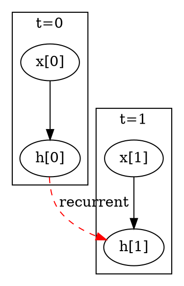
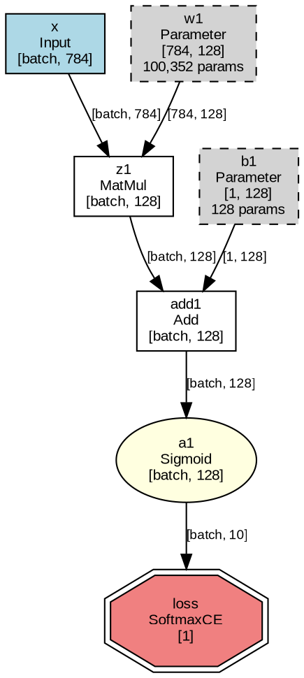

# Graph 序列化与可视化设计

> 统一的图描述层（IR）设计，支持模型保存/加载、可视化、调试输出
>
> ✅ **状态**：已实现（2025-12-27），详见 `src/nn/graph.rs` 和 `src/nn/descriptor.rs`
>
> 📖 **用户指南**：如需了解可视化的使用方法和解读技巧，请参阅 [计算图可视化指南](visualization_guide.md)

## 1. 设计目标

| 功能 | 描述 | 输出格式 |
|------|------|----------|
| **save/load** | 保存完整模型（拓扑+参数） | JSON + bin |
| **visualize** | 生成网络结构图 | Graphviz DOT |
| **summary** | 打印 Keras 风格摘要 | 文本表格 |

**核心思想**：设计统一的 `GraphDescriptor` 作为中间表示（IR），三个功能共享同一数据源。

## 2. 架构设计

```
                    ┌─────────────────────┐
                    │      Graph          │
                    │  (运行时结构)        │
                    └──────────┬──────────┘
                               │ graph.describe()
                               ▼
                    ┌─────────────────────┐
                    │  GraphDescriptor    │
                    │  (可序列化的 IR)     │
                    └──────────┬──────────┘
                               │
         ┌─────────────────────┼─────────────────────┐
         ▼                     ▼                     ▼
  ┌─────────────┐      ┌─────────────┐      ┌─────────────┐
  │  to_json()  │      │  to_dot()   │      │ to_summary()│
  │  保存模型   │      │  Graphviz   │      │  文本摘要   │
  └─────────────┘      └─────────────┘      └─────────────┘
```

## 3. 数据结构

### 3.1 GraphDescriptor（核心 IR）

```rust
/// 图的可序列化描述
#[derive(Serialize, Deserialize)]
pub struct GraphDescriptor {
    /// 格式版本（用于向后兼容）
    pub version: String,
    /// 图名称
    pub name: String,
    /// 所有节点描述
    pub nodes: Vec<NodeDescriptor>,
    /// 参数文件路径（相对于 JSON 文件）
    pub params_file: Option<String>,
}

/// 节点描述
#[derive(Serialize, Deserialize)]
pub struct NodeDescriptor {
    pub id: u64,
    pub name: String,
    pub node_type: NodeTypeDescriptor,
    pub output_shape: Vec<usize>,
    /// 父节点 ID 列表（定义拓扑）
    pub parents: Vec<u64>,
}

/// 节点类型描述（包含类型特定参数）
#[derive(Serialize, Deserialize)]
#[serde(tag = "type")]
pub enum NodeTypeDescriptor {
    Input,
    Parameter { param_count: usize },
    Add,
    MatMul,
    Sigmoid,
    Tanh,
    ReLU,
    LeakyReLU { alpha: f32 },
    Conv2d { stride: (usize, usize), padding: (usize, usize) },
    MaxPool2d { kernel_size: (usize, usize), stride: (usize, usize) },
    AvgPool2d { kernel_size: (usize, usize), stride: (usize, usize) },
    SoftmaxCrossEntropy,
    MSELoss,
    // ... 其他节点类型
}
```

### 3.2 JSON 格式示例

```json
{
  "version": "0.4.0",
  "name": "mnist_classifier",
  "nodes": [
    { "id": 1, "name": "x", "node_type": { "type": "Input" },
      "output_shape": [1, 784], "parents": [] },
    { "id": 2, "name": "w1", "node_type": { "type": "Parameter", "param_count": 100352 },
      "output_shape": [784, 128], "parents": [] },
    { "id": 3, "name": "z1", "node_type": { "type": "MatMul" },
      "output_shape": [1, 128], "parents": [1, 2] },
    { "id": 4, "name": "a1", "node_type": { "type": "Sigmoid" },
      "output_shape": [1, 128], "parents": [3] }
  ],
  "params_file": "mnist_classifier.bin"
}
```

## 4. API 设计

### 4.1 分层 API

```rust
impl Graph {
    // ========== Level 1: 仅参数（轻量）==========
    /// 保存所有参数到二进制文件
    pub fn save_params(&self, path: &str) -> Result<(), GraphError>;
    /// 加载参数（需先构建相同结构的图）
    pub fn load_params(&mut self, path: &str) -> Result<(), GraphError>;

    // ========== Level 2: 完整模型 ==========
    /// 导出图描述
    pub fn describe(&self) -> GraphDescriptor;
    /// 保存完整模型（JSON + bin）
    pub fn save_model(&self, path: &str) -> Result<(), GraphError>;
    /// 从文件加载完整模型
    pub fn load_model(path: &str) -> Result<Self, GraphError>;

    // ========== Level 3: 可视化/调试 ==========
    /// 生成 Graphviz DOT 格式
    pub fn to_dot(&self) -> String;
    /// 保存 DOT 文件
    pub fn save_dot(&self, path: &str) -> Result<(), GraphError>;
    /// 打印 Keras 风格摘要
    pub fn summary(&self);
    /// 返回摘要字符串（Unicode 表格）
    pub fn summary_string(&self) -> String;
    /// 返回 Markdown 格式摘要
    pub fn summary_markdown(&self) -> String;
    /// 保存摘要（根据扩展名自动选择格式：.md=Markdown，其他=文本）
    pub fn save_summary(&self, path: &str) -> Result<(), GraphError>;
}
```

### 4.2 使用示例

```rust
// 保存模型
graph.save_model("models/mnist.json")?;
// 生成文件：models/mnist.json + models/mnist.bin

// 加载模型
let graph = Graph::load_model("models/mnist.json")?;

// 可视化（生成 DOT 文件，可用 Graphviz 渲染）
std::fs::write("graph.dot", graph.to_dot())?;
// 命令行：dot -Tpng graph.dot -o graph.png

// 打印摘要
println!("{}", graph.summary());
// 输出：
// ┌──────────────────────────────────────────────────────────┐
// │ Node (type)          Output Shape         Params         │
// ├──────────────────────────────────────────────────────────┤
// │ x (Input)            [1, 784]             0              │
// │ w1 (Parameter)       [784, 128]           100,352        │
// │ z1 (MatMul)          [1, 128]             0              │
// │ a1 (Sigmoid)         [1, 128]             0              │
// └──────────────────────────────────────────────────────────┘
// Total params: 100,352
```

## 5. DOT 可视化设计（`to_dot()`）

### 5.1 设计原则

1. **完整性**：准确反映模型的所有节点和连接，包括循环结构（RNN）
2. **可读性**：清晰的布局、合理的节点标签、颜色区分
3. **可扩展性**：支持前馈网络、CNN、RNN 等各类拓扑

### 5.2 节点样式

| 节点类型 | 形状 | 颜色 | 说明 |
|----------|------|------|------|
| Input | `box` | `lightblue` | 输入节点 |
| Parameter | `box`, 虚线 | `lightgray` | 可训练参数 |
| 激活函数 | `ellipse` | `lightyellow` | Sigmoid, Tanh, ReLU 等 |
| 运算节点 | `box` | `white` | MatMul, Add, Conv2d 等 |
| Loss | `doubleoctagon` | `lightcoral` | 损失函数 |

### 5.3 循环结构（RNN）表示

对于 RNN 等包含循环连接的网络，DOT 需要特殊处理：



**策略**：
- 循环边用**虚线红色箭头**标注 `recurrent`
- 可选：展开若干时间步显示结构
- 自环（self-loop）用曲线箭头表示

### 5.4 边标签（Edge Labels）

边上可以显示数据流信息，如张量形状、参数值等：

```dot
// 边带标签示例
x -> z1 [label="[batch, 784]"];           // 显示张量形状
w1 -> z1 [label="[784, 128]"];
scalar -> mul [label="α=0.01"];            // 显示标量值
h_0 -> h_1 [label="hidden", style=dashed]; // RNN 隐状态
```

### 5.5 完整输出示例



渲染命令：`dot -Tpng graph.dot -o graph.png`

---

## 6. Summary 设计（`summary()`）

### 6.1 设计原则（取各框架之长）

| 来源 | 借鉴点 | 改进点 |
|------|--------|--------|
| **Keras** | 清晰的表格格式 | 添加连接信息 |
| **PyTorch torchinfo** | 显示输入/输出形状 | 简化层次结构 |
| **TensorFlow** | 参数统计详细 | 避免过于冗长 |

### 6.2 输出格式（中文）

```
╔══════════════════════════════════════════════════════════════════════════════╗
║                          计算图: "mnist_classifier"                           ║
╠══════════════════════════════════════════════════════════════════════════════╣
║ 节点名             类型              输出形状           参数量    父节点      ║
╠══════════════════════════════════════════════════════════════════════════════╣
║ x                  Input             [batch, 784]       0         -          ║
║ w1                 Parameter         [784, 128]         100,352   -          ║
║ b1                 Parameter         [1, 128]           128       -          ║
║ z1                 MatMul            [batch, 128]       0         x, w1      ║
║ add1               Add               [batch, 128]       0         z1, b1     ║
║ a1                 Sigmoid           [batch, 128]       0         add1       ║
║ w2                 Parameter         [128, 10]          1,280     -          ║
║ b2                 Parameter         [1, 10]            10        -          ║
║ z2                 MatMul            [batch, 10]        0         a1, w2     ║
║ add2               Add               [batch, 10]        0         z2, b2     ║
║ loss               SoftmaxCE         [1]                0         add2       ║
╠══════════════════════════════════════════════════════════════════════════════╣
║ 总参数量: 101,770                                                             ║
║ 可训练参数: 101,770                                                           ║
║ 不可训练参数: 0                                                               ║
╚══════════════════════════════════════════════════════════════════════════════╝
```

### 6.3 与 Keras 的区别

| 特性 | Keras | only_torch | 理由 |
|------|-------|------------|------|
| **Parents 列** | ❌ 不显示 | ✅ 显示 | 展示拓扑连接，便于理解数据流 |
| **节点粒度** | Layer（粗） | Node（细） | only_torch 是节点级别，更精确 |
| **嵌套缩进** | ✅ 支持 | ❌ 暂不支持 | 保持简洁，NEAT 图通常扁平 |
| **内存占用** | ✅ 显示 | ❌ 暂不显示 | CPU-only，内存不是主要关注点 |

### 6.4 输出格式与保存

Summary 支持两种输出格式：

| 格式 | 方法 | 说明 |
|------|------|------|
| **Unicode 文本** | `summary_string()` | 使用 `┌─┬─┐` 等 Unicode 字符绘制表格，适合控制台显示 |
| **Markdown** | `summary_markdown()` | 标准 Markdown 表格语法，适合嵌入文档 |

`save_summary()` 会根据文件扩展名**自动选择格式**：

```rust
// 保存为文本格式（Unicode 表格）
graph.save_summary("model.txt")?;

// 保存为 Markdown 格式
graph.save_summary("model.md")?;  // 自动识别 .md 扩展名

// 直接打印到控制台
graph.summary();

// 获取字符串用于自定义处理
let text = graph.summary_string();      // Unicode 表格
let markdown = graph.summary_markdown(); // Markdown 表格
```

### 6.5 可选参数（未来扩展）

```rust
// 详细版（未来可扩展）
graph.summary_with_options(SummaryOptions {
    show_parents: true,      // 显示父节点
    show_shapes: true,       // 显示形状
    show_params: true,       // 显示参数量
    max_depth: None,         // 展开深度（用于嵌套图）
});
```

---

## 7. 参数文件格式（.bin）

采用简单的键值对格式：

```
┌─────────────────────────────────────────────┐
│ Header                                      │
│   magic: [u8; 4] = "OTPR"                   │  // Only Torch PaRams
│   version: u32 = 1                          │
│   param_count: u32                          │
├─────────────────────────────────────────────┤
│ Entry 1                                     │
│   name_len: u32                             │
│   name: [u8; name_len]                      │
│   shape_dims: u32                           │
│   shape: [u32; shape_dims]                  │
│   data: [f32; prod(shape)]                  │
├─────────────────────────────────────────────┤
│ Entry 2 ...                                 │
└─────────────────────────────────────────────┘
```

## 8. 实施优先级

| 阶段 | 功能 | 复杂度 | 依赖 | 状态 |
|------|------|--------|------|------|
| **P1** | `save_params` / `load_params` | ⭐ | 现有 Tensor::save | ✅ 已完成 |
| **P2** | `GraphDescriptor` + `describe()` | ⭐⭐ | P1 | ✅ 已完成 |
| **P3** | `save_model` / `load_model` | ⭐⭐ | P2 | ✅ 已完成 |
| **P4** | `summary()` / `summary_markdown()` | ⭐ | P2 | ✅ 已完成 |
| **P5** | `to_dot()` / `save_dot()` | ⭐ | P2 | ✅ 已完成 |

## 9. NEAT 兼容性

此设计对 NEAT 友好：

- **动态拓扑**：`parents` 数组可表示任意连接关系
- **异构节点**：`NodeTypeDescriptor` 枚举支持所有节点类型
- **进化保存**：完整模型保存可记录进化后的网络结构

## 10. 与 ONNX 的对比

| 特性 | only_torch 格式 | ONNX |
|------|-----------------|------|
| 可读性 | ✅ JSON 可读 | ❌ Protobuf 二进制 |
| 依赖 | ✅ 仅 serde | ❌ 需要 protobuf |
| NEAT 支持 | ✅ 任意拓扑 | ❌ 固定操作集 |
| 跨框架 | ❌ only_torch 专用 | ✅ 工业标准 |

**设计选择**：优先自身生态完整性，未来可按需添加 ONNX 导出。

## 11. 跨框架导入（可选/长期）

> ⚠️ **非近期目标**：由于各框架的计算图结构、预设层定义、操作语义存在本质差异，跨框架模型导入复杂度高，暂不纳入近期计划。

### 可行路径（仅作参考）

| 路径 | 方式 | 复杂度 | 说明 |
|------|------|--------|------|
| **ONNX 中转** | `Graph::import_onnx()` | ⭐⭐⭐⭐ | 工业标准，但操作集可能不完全匹配 only_torch |
| **Python 脚本** | 手动转换 | ⭐⭐ | 灵活但需用户手动对齐拓扑 |
| **直接解析** | `Graph::import_pytorch()` | ⭐⭐⭐⭐⭐ | 需解析 pickle，每框架单独实现 |

### 为何暂不实现

1. **结构差异**：PyTorch/Keras 的 Layer 抽象与 only_torch 的节点粒度不同
2. **操作语义**：同名操作可能有细微行为差异（如 padding 方式）
3. **NEAT 优先**：only_torch 核心目标是支持网络进化，而非复用其他框架模型
4. **MVP 聚焦**：先完善自身生态，再考虑互操作性

### 扩展预留

`GraphDescriptor` 设计足够通用，未来如需实现导入功能，可作为目标格式：

```
ONNX/PyTorch/Keras ──► 转换器 ──► GraphDescriptor ──► Graph
```

## 12. 可视化设计说明

### 节点标签格式

使用 HTML-like 标签，**类型名称加粗**：

```dot
"1" [label=<g_w2<BR/><B>Parameter</B><BR/>[128, 784]<BR/>(100,352 params)>];
```

显示顺序：节点名 → **类型（加粗）** → 形状 → 参数量（可选）→ 额外信息（如 α=0.2）

### 边无标签设计

边只表示数据流方向，**不显示任何标签**：

```dot
"W" -> "MatMul";
"x" -> "MatMul";
```

**设计理由**：

1. **形状信息在节点内**：每个节点已显示输出形状，边上再显示是冗余
2. **图更简洁**：无标签的边让拓扑结构一目了然

### 动态图例

图例区域显示**节点类型**（中文），只包含当前图中实际出现的类型：

| 类型 | 形状 | 颜色 |
|------|------|------|
| 输入 | 椭圆 | 浅蓝 #E3F2FD |
| 参数 | 矩形 | 浅绿 #E8F5E9 |
| 运算 | 圆角矩形 | 浅黄 #FFFDE7 |
| 激活 | 菱形 | 浅橙 #FFF3E0 |
| 损失 | 双八边形 | 浅红 #FFEBEE |

### NEAT 风格（长期/可选）

如果未来实现 NEAT 架构（边承载标量权重），需要全新的图结构和可视化模式，与当前算子图是两种不同的抽象层次。

---

## 13. 参考

- [PyTorch state_dict](https://pytorch.org/tutorials/beginner/saving_loading_models.html)
- [Keras model.summary()](https://keras.io/api/models/model/#summary-method)
- [Graphviz DOT Language](https://graphviz.org/doc/info/lang.html)
- [SafeTensors Format](https://github.com/huggingface/safetensors)
- [ONNX Format](https://onnx.ai/)
- [NEAT (NeuroEvolution of Augmenting Topologies)](http://nn.cs.utexas.edu/downloads/papers/stanley.ec02.pdf)

