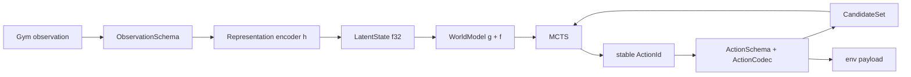

# MyZero 通用 learned world model 地基

> 状态：✅ 前两阶段完成（2026-07-10）
> 定位：后续主动数据生成、recurrent POMDP 与 stochastic planning 的共同工程地基。
> 原则：生产搜索始终使用 learned dynamics；真规则 / env snapshot 只在 `cfg(test)` 的 reference diagnostic 中存在。

## 1. 本阶段解决什么

此前 MyZero 的三个隐含假设是：

1. observation 最终就是一个无语义的 `Vec<f32>`；
2. action 是单维离散或单维连续桶；
3. MCTS 边上的 payload 就等于 dynamics 的 policy 槽位。

这些假设能覆盖 CartPole / Pendulum，却无法稳定扩展到矩形图像、Dict observation、
MultiDiscrete、固定 Hybrid，更会让非离散 payload 在 dynamics 中静默退回 action 0。

本阶段把当前 deterministic MuZero 显式收编为通用 learned-world-model 契约的轻量特例，
保持现有 recipe 行为不变，同时用真实目标画像所需的最小纵切验证扩展面。

## 2. 四个核心契约

- [`ObservationSchema`](../../src/rl/algo/my_zero/schema.rs)：描述 Flat、方/矩形 Image、
  Board、Image+Dense、固定长度 Tokens 的形状与语义；Tensor 和 latent 仍全部是 f32。
- [`ActionSchema` / `ActionCodec`](../../src/rl/algo/my_zero/schema.rs)：描述 Discrete、
  MultiDiscrete、多维连续 categorical bins 与固定 Hybrid，并提供稳定 joint `ActionId`
  与 env payload 的双向映射。
- [`LatentState`](../../src/rl/mcts/dynamics.rs)：MCTS learned latent 的透明 newtype；
  无额外分配，后续可扩 recurrent hidden / stochastic planner state。
- [`WorldModel`](../../src/rl/mcts/dynamics.rs)：associated `State` 可直接承载 recurrent
  hidden / chance code；历史 `Dynamics<Vec<f32>>` 接口保留，并由 blanket adapter 接入。
  `WorldModel::recurrent` 同时接收 `ActionId` 与 `ActionPayload`，不再靠 payload 猜槽位。

## 3. Observation 纵切

- 图像预处理尺寸从固定 84×84 扩为运行时 `(height, width, history)`；默认仍是
  84×84×4，replay 继续只存 U8 单帧。
- `ConvRepresentationNet` 支持矩形输入，不再要求裁成方图。
- Gymnasium `Dict` observation 可保留 component key；固定 Image+Dense 走
  CNN + MLP 双分支再融合。
- token 环境直接提供固定长度 token IDs。adapter 校验 ID 为 f32 可精确表示的整数，
  自动追加 padding mask；模型走动态 `Embedding` + 轻量 sequence encoder。
- `StoredObs` 仍只有 F32 / U8；本阶段没有引入新 dtype 或通用对象容器。

## 4. Action 纵切

- `MultiDiscrete([4,4,16])` 使用 mixed-radix 稳定映射，共 256 个 joint action；
  policy head 使用 4+4+16 的 factorized categorical 输出，MCTS 仍消费 joint candidates。
- 二维连续使用每维 categorical bins；固定 Tuple Hybrid 已用 `Platform-v0`
  验证离散 factor + 三维连续 bins。
- factorized visit target 由 joint MCTS 分布投影成各 factor 的边缘分布；
  推理时各 factor prior 的乘积还原 joint prior。
- Sampled MuZero 仍在每个节点依据当前网络 prior 采 K 个 joint candidates，
  继续复用既有 `π̂β ∝ (β̂/β)·π` 校正。
- 联合空间暂设 2048 的显式上限，且 joint 数 ≥128 时自动开启 Sampled（Gumbel 除外），防高维 `B^D`
  静默爆内存；真正无枚举 continuous
  proposal 留真实需求驱动。
- variable-length / autoregressive action 不在本阶段实现。固定因子、跨环境时间步的
  连招都不需要把单步 action 改成 token 序列。

## 5. 兼容与隔离

- CartPole / Pendulum 的单 factor policy 继续走原 categorical loss 与推理快路径。
- `.otm` 契约新增可选 observation 描述；旧文件缺该字段时仍可加载。
- 棋盘 `board` / `gomoku` reference transition 代码只在 `cfg(test)` 编译，
  不进入 production runtime backend。
- `SearchResult` 公开 `recommended_id`；env 执行使用 codec，world model 使用同一 ID，
  从结构上消灭非离散 payload → action 0 的静默错误。

## 6. 验收证据

- `just test`：3421 主测试 + 集成测试 + doctests 全绿。
- `just test-filter rl`：344 passed，0 failed。
- `just smoke-rl`：既有 RL 管线 + 四个 schema toy + Platform Hybrid 全绿。
- CartPole 3-seed 哨兵：8,741 / 71,969 / 6,744 env-steps，中位 8,741，3/3 达标；
  与既有官方基线逐值一致。
- 前向 Criterion：
  - 同机隔离旧 HEAD 对照 root 15.0–15.9 µs / recurrent 21.5–22.4 µs；
    新路径复测 14.8–15.5 µs / 22.0–22.7 µs，区间重叠、无实质回归；
  - MultiDiscrete([4,4,16]) recurrent（含 256 joint prior 解码）约 67–71 µs。
- 图像组装新增 history=1/8 case，内存与计算量按 history 线性增长，默认融合组装路径不变。

## 7. 后续阶段如何建立在此之上

1. **主动数据生成（3A0 已负裁，2026-07-12）**：稳定 `WorldModel` / schema
   接缝已足够；但 Gomoku 实测 continuation proxy 虽任务相关，新增真实数据
   训练后 2/3 seed 反而增大，当前协议未证明其可稳定降低，故未进入 ErrorQ /
   Collector。详见
   [棋盘账本 Phase 3A0](../../examples/my_zero/gomoku/README.md#phase-3a0--主动数据误差-proxy-审计2026-07-12)。
2. **recurrent POMDP（2026-07-14 负裁）**：`LatentState` + posterior hidden + burn-in 已入库；
   velocity-masked CartPole ON ~45 vs OFF ~40 未达标，归因容量/预算，架构未否定，
   代码保留默认关（[issue](../../.issue/items/my_zero_pomdp_lite_posterior_negative.md)）。
3. **stochastic planning（2026-07-15 验收）**：Stochastic MuZero always-on 实现。afterstate dynamics +
   chance encoder（Gumbel-Softmax ST）+ KL(posterior‖prior) loss + chance-in-edge 搜索（不消耗树深度）。
   确定性 CartPole K=8 3/3（26k，1.7x）；StochasticCartPole K=8 3/3 vs K=1 2/3。默认 K=8，
   确定性环境 chance distribution 自动退化为单峰。
4. **跨轴验收**：只有 native 环境统计 benchmark 通过后，才把接口就绪升级为生产支持。

本地接口纵切不等于算法价值证明；smoke 只证明骨架通顺，不替代后续 native 环境的收敛验收。
