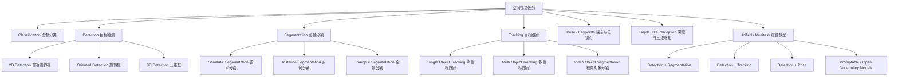

# 空间视觉任务路线图

本文档梳理 only_torch 在图像 / 视频空间域任务上的任务地图、当前能力与后续路线。它不是具体实现设计，具体算子、Evolution 结构和数据管道仍以对应设计文档为准。

状态约定：

- `[x]`：已有可运行能力或示例。
- `[~]`：已有教学级 / toy 级闭环，但距离通用任务仍有明显缺口。
- `[ ]`：暂未支持。

## 任务全景



## 核心任务关系

| 任务 | 回答的问题 | 典型输出 | 代表方向 |
|---|---|---|---|
| Classification | 图里是什么 | 类别或多标签 | MNIST / ImageNet 分类 |
| 2D Detection | 物体在哪里 | `bbox + class + confidence` | YOLO / Faster R-CNN / RT-DETR |
| Oriented Detection | 旋转物体在哪里 | 旋转框或四点框 | 遥感、文档、棋盘格等 |
| 3D Detection | 物体在三维空间哪里 | 3D bbox / 位姿 / 深度 | 自动驾驶、机器人 |
| Semantic Segmentation | 每个像素属于哪一类 | 每像素类别图 | FCN / U-Net / DeepLab |
| Instance Segmentation | 每个独立物体的轮廓是什么 | 变长 `mask + class + confidence` 列表 | Mask R-CNN / YOLO-seg |
| Panoptic Segmentation | 背景区域和独立物体分别是什么 | 语义区域 + 实例 ID | Mask2Former / Mask DINO |
| Tracking | 同一个目标跨帧如何移动 | `track_id + bbox/mask` 序列 | SORT / DeepSORT / ByteTrack |
| Pose / Keypoints | 关键点在哪里 | 关键点坐标 / skeleton | 人体姿态、手势、物体关键点 |
| Unified Models | 多个任务能否共用模型 | 多头或统一 query 输出 | Mask R-CNN、YOLO-seg、SAM 系列 |

从任务难度看，可以粗略理解为：

```text
分类
  -> 检测：从“是什么”扩展到“在哪里”
  -> 语义分割：从图像级标签扩展到像素级标签
  -> 实例分割：在像素级标签上区分不定数量的独立对象
  -> 全景分割：同时处理背景语义区域和前景实例

视频任务
  -> 在检测 / 分割输出上增加时间一致性和 track id
```

## 当前能力矩阵

| 方向 | 子任务 | 状态 | 当前项目能力 | 主要缺口 |
|---|---|---|---|---|
| Classification | 图像分类 | `[x]` | `mnist`、`mnist_cnn`、`evolution_mnist` 已覆盖手写模型与空间域演化 | 大规模真实数据和性能优化仍有限 |
| Detection | 单目标 2D bbox | `[~]` | `single_object_detection` 可训练 16x16 合成图像单框回归 | 不是多目标检测；没有 objectness、类别、多尺度、NMS、mAP |
| Detection | 多目标 2D Detection | `[ ]` | `chess_yolo_onnx_detect` 可导入第三方 YOLO ONNX 做推理演示 | only_torch 原生训练 / 演化检测头尚未支持 |
| Detection | Oriented Detection | `[ ]` | 暂无 | 需要旋转框表示、角度损失、旋转 IoU |
| Detection | 3D Detection | `[ ]` | 暂无 | 需要深度 / 点云 / 相机几何等数据表示 |
| Segmentation | 二值语义分割 | `[~]` | `single_object_segmentation` 可训练 16x16 合成 mask | 数据过 toy；Evolution 尚未接入 spatial-to-spatial 输出 |
| Segmentation | 多类别语义分割 | `[ ]` | 暂无 | 需要 per-pixel CrossEntropy、Mean IoU、多类别 mask 数据 |
| Segmentation | 固定 slot 实例分割 | `[~]` | `multi_instance_segmentation` 支持固定 2 slot mask | 不支持不定数量实例、类别、confidence、matching |
| Segmentation | 通用实例分割 | `[ ]` | 暂无 | 需要变长实例列表、mask matching、实例级指标 |
| Segmentation | 全景分割 | `[ ]` | 暂无 | 依赖语义分割 + 实例分割统一表示 |
| Tracking | 单 / 多目标跟踪 | `[ ]` | 暂无 | 需要视频数据、track id、跨帧关联指标 |
| Pose | 关键点检测 | `[ ]` | 暂无 | 需要 heatmap 或关键点回归头与 OKS 类指标 |
| Depth / 3D | 深度估计 / 3D 感知 | `[ ]` | 暂无 | 需要深度图、相机模型或点云表示 |
| Unified | 多头视觉模型 | `[~]` | 传统 API 已有多输入 / 多输出示例 | Evolution 仍未支持多输出任务聚合 |
| Unified | Mask R-CNN / YOLO-seg-lite | `[ ]` | 暂无原生实现 | 依赖检测头、mask 头、多输出 loss 和实例匹配 |

## 近期路线

当前最值得推进的是先把分割做扎实，再把它接入 Evolution。原因是分割能直接验证空间输入、空间输出、Conv2d / ConvTranspose2d、FM 粒度演化和 FLOPs 选择等能力；检测和实例分割则需要更多任务协议与多输出基础设施。

| 优先级 | 事项 | 状态 | 目标 |
|---|---|---|---|
| P0 | 建立空间视觉任务路线图 | `[x]` | 统一术语、任务边界和能力矩阵 |
| P1 | Segmentation v2 数据与指标 | `[ ]` | 将 16x16 toy 升级到更可信的小 benchmark，补 Dice / Mean IoU 等指标 |
| P2 | Segmentation Evolution | `[ ]` | 增加 segmentation metric / loss / spatial-to-spatial minimal genome |
| P3 | FCN / U-Net 风格传统强基线 | `[ ]` | 给 Segmentation Evolution 一个可对照的手写基线 |
| P4 | YOLO-lite Detection 前置能力 | `[ ]` | 支持 grid head、objectness、bbox loss、简化 NMS / mAP |
| P5 | 多输出 / 多头 Evolution | `[ ]` | 支持 detection + mask 等多任务输出与 loss 聚合 |
| P6 | Instance Segmentation Lite | `[ ]` | 从固定 slot 过渡到可变实例、matching 和实例级指标 |
| P7 | Tracking / Panoptic / 3D | `[ ]` | 作为远期路线，等基础视觉任务稳定后再进入 |

## 与现有文档的关系

- Evolution 主流程、变异、ASHA 与搜索策略详见 [神经架构演化设计](neural_architecture_evolution_design.md)。
- Node 与 Layer 的职责边界详见 [节点与层边界设计](node_vs_layer_design.md)。
- DataLoader 与变长数据处理详见 [数据加载设计](data_loader_design.md)。
- ONNX 导入与第三方视觉模型互通详见 [ONNX 导入/互通策略设计](onnx_import_strategy.md)。
