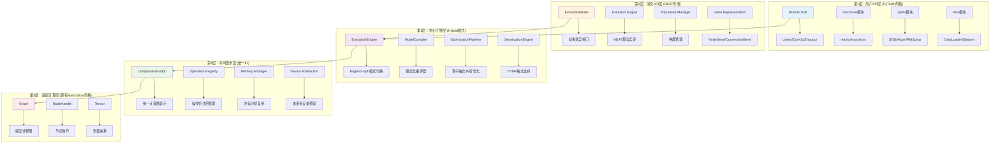

# Only Torch 高层架构设计方案

## 1. 设计目标与核心理念

### 1.1 核心设计目标
- **PyTorch风格API**：提供直观易用的模块化模型定义和训练接口
- **演化优先设计**：深度集成NEAT算法，支持网络结构的自动演化
- **Hybrid执行引擎**：借鉴MXNet hybrid思想，支持eager/graph双模式执行
- **模型序列化**：统一的模型格式，支持跨语言部署和演化历史追踪
- **CPU专用优化**：专注CPU计算，无设备抽象复杂性

### 1.2 核心竞争优势
- **独特演化能力**：区别于传统ML框架的结构自动优化
- **渐进式优化**：开发时用eager模式，部署时用graph模式
- **轻量级设计**：专注核心功能，避免过度工程化
- **Rust性能**：内存安全 + 零成本抽象 + 高性能计算

## 2. 五层架构设计



## 3. Hybrid执行引擎设计 (核心创新)

### 3.1 双模式执行机制

借鉴MXNet hybrid思想，支持两种执行模式的无缝切换：

```rust
#[derive(Debug, Clone, Copy)]
pub enum ExecutionMode {
    /// Eager模式：立即执行，便于调试和演化
    Eager,
    /// Graph模式：延迟执行，性能优化
    Graph,
}

pub trait HybridExecutable {
    /// 设置执行模式
    fn set_mode(&mut self, mode: ExecutionMode);
    /// 编译为优化的计算图（切换到Graph模式前调用）
    fn compile(&mut self) -> Result<(), GraphError>;
    /// 获取当前执行模式
    fn mode(&self) -> ExecutionMode;
}
```

### 3.2 执行引擎核心实现

```rust
pub struct ExecutionEngine {
    mode: ExecutionMode,
    eager_executor: EagerExecutor,
    graph_executor: Option<GraphExecutor>,
    optimization_pipeline: OptimizationPipeline,
}

impl ExecutionEngine {
    pub fn forward(&mut self, computation: &ComputationGraph) -> Result<Tensor, GraphError> {
        match self.mode {
            ExecutionMode::Eager => {
                // 立即执行，便于调试
                self.eager_executor.execute(computation)
            }
            ExecutionMode::Graph => {
                // 使用编译优化的图执行
                self.graph_executor
                    .as_mut()
                    .ok_or(GraphError::NotCompiled)?
                    .execute(computation)
            }
        }
    }

    pub fn compile(&mut self, computation: &ComputationGraph) -> Result<(), GraphError> {
        // 应用优化管道
        let optimized_graph = self.optimization_pipeline.optimize(computation)?;

        // 创建图执行器
        self.graph_executor = Some(GraphExecutor::new(optimized_graph)?);
        self.mode = ExecutionMode::Graph;
        Ok(())
    }
}
```

### 3.3 优化管道设计

```rust
pub struct OptimizationPipeline {
    passes: Vec<Box<dyn OptimizationPass>>,
}

pub trait OptimizationPass {
    fn apply(&self, graph: &mut ComputationGraph) -> Result<(), GraphError>;
    fn name(&self) -> &str;
}

// 具体优化实现
pub struct OperatorFusion;  // 算子融合
pub struct MemoryOptimization;  // 内存优化
pub struct DeadCodeElimination;  // 死代码消除
pub struct ConstantFolding;  // 常量折叠
```

## 4. 演化API设计 (核心优势)

### 4.1 演化模型接口

```rust
pub trait EvolvableModel: Module + Clone {
    type Gene: Clone + Serialize + DeserializeOwned;

    /// 获取模型的基因表示
    fn to_genes(&self) -> Vec<Self::Gene>;

    /// 从基因构建模型
    fn from_genes(genes: &[Self::Gene]) -> Result<Self, EvolutionError>;

    /// 结构变异
    fn mutate_structure(&mut self, mutation_rate: f32) -> Result<(), EvolutionError>;

    /// 权重变异
    fn mutate_weights(&mut self, mutation_rate: f32, mutation_strength: f32) -> Result<(), EvolutionError>;

    /// 交叉操作
    fn crossover(&self, other: &Self) -> Result<Self, EvolutionError>;

    /// 计算结构复杂度（用于适应度计算）
    fn complexity(&self) -> f32;
}
```

### 4.2 NEAT基因表示

```rust
#[derive(Debug, Clone, Serialize, Deserialize)]
pub struct NodeGene {
    pub id: u32,
    pub node_type: NodeType,
    pub activation: ActivationType,
    pub layer: u32,  // 用于拓扑排序
}

#[derive(Debug, Clone, Serialize, Deserialize)]
pub struct ConnectionGene {
    pub innovation_id: u32,
    pub from_node: u32,
    pub to_node: u32,
    pub weight: f32,
    pub enabled: bool,
}

#[derive(Debug, Clone, Serialize, Deserialize)]
pub struct NEATGenome {
    pub node_genes: HashMap<u32, NodeGene>,
    pub connection_genes: HashMap<u32, ConnectionGene>,
    pub fitness: Option<f32>,
}
```

### 4.3 演化引擎

```rust
pub struct EvolutionEngine<T: EvolvableModel> {
    config: NEATConfig,
    innovation_tracker: InnovationTracker,
    species_manager: SpeciesManager<T>,
}

impl<T: EvolvableModel> EvolutionEngine<T> {
    pub fn evolve(&mut self, population: Population<T>) -> Result<Population<T>, EvolutionError> {
        // 1. 评估适应度
        let evaluated_pop = self.evaluate_fitness(population)?;

        // 2. 物种分化
        let species = self.species_manager.speciate(evaluated_pop)?;

        // 3. 选择和繁殖
        let offspring = self.reproduce(species)?;

        // 4. 变异
        let mutated = self.mutate(offspring)?;

        Ok(mutated)
    }
}
```

## 5. 模型序列化设计 (OTMF格式)

### 5.1 OnlyTorch Model Format (OTMF) 规范

OTMF采用JSON+二进制的混合格式，支持演化信息和优化信息：

```rust
#[derive(Serialize, Deserialize)]
pub struct OTMFModel {
    // 元数据
    pub metadata: ModelMetadata,
    // 计算图结构
    pub graph: GraphStructure,
    // 演化信息（可选）
    pub evolution: Option<EvolutionInfo>,
    // 优化信息（可选）
    pub optimization: Option<OptimizationInfo>,
    // 参数数据引用（指向二进制文件）
    pub parameters: ParameterReferences,
}

#[derive(Serialize, Deserialize)]
pub struct ModelMetadata {
    pub version: String,
    pub framework_version: String,
    pub created_at: DateTime<Utc>,
    pub model_type: String,
    pub input_shapes: Vec<Vec<usize>>,
    pub output_shapes: Vec<Vec<usize>>,
}
```

### 5.2 序列化引擎

```rust
pub struct SerializationEngine;

impl SerializationEngine {
    /// 保存模型到OTMF格式
    pub fn save_model<T: Module + EvolvableModel>(
        model: &T,
        path: &Path,
    ) -> Result<(), SerializationError> {
        // 1. 提取模型结构
        let graph_structure = self.extract_graph_structure(model)?;

        // 2. 提取参数数据
        let parameters = self.extract_parameters(model)?;

        // 3. 提取演化信息
        let evolution_info = if let Ok(genes) = model.to_genes() {
            Some(EvolutionInfo::from_genes(&genes))
        } else {
            None
        };

        // 4. 构建OTMF模型
        let otmf_model = OTMFModel {
            metadata: ModelMetadata::new(model),
            graph: graph_structure,
            evolution: evolution_info,
            optimization: None, // 运行时填充
            parameters: ParameterReferences::new(&parameters),
        };

        // 5. 保存JSON描述文件
        let json_path = path.with_extension("otmf");
        let json_content = serde_json::to_string_pretty(&otmf_model)?;
        std::fs::write(&json_path, json_content)?;

        // 6. 保存二进制参数文件
        let bin_path = path.with_extension("otmf.bin");
        self.save_parameters_binary(&parameters, &bin_path)?;

        Ok(())
    }

    /// 从OTMF格式加载模型
    pub fn load_model<T: Module + EvolvableModel>(
        path: &Path,
    ) -> Result<T, SerializationError> {
        // 1. 加载JSON描述
        let json_path = path.with_extension("otmf");
        let json_content = std::fs::read_to_string(&json_path)?;
        let otmf_model: OTMFModel = serde_json::from_str(&json_content)?;

        // 2. 加载二进制参数
        let bin_path = path.with_extension("otmf.bin");
        let parameters = self.load_parameters_binary(&bin_path, &otmf_model.parameters)?;

        // 3. 重建模型
        let model = if let Some(evolution_info) = &otmf_model.evolution {
            // 从演化信息重建
            T::from_genes(&evolution_info.genes)?
        } else {
            // 从图结构重建
            T::from_graph_structure(&otmf_model.graph)?
        };

        // 4. 加载参数
        self.load_parameters_into_model(&model, &parameters)?;

        Ok(model)
    }
}

## 6. 用户API设计 (PyTorch风格)

### 6.1 模块系统

```rust
// 模块基类 - 类似PyTorch nn.Module
pub trait Module: HybridExecutable {
    fn forward(&mut self, input: &Tensor) -> Result<Tensor, GraphError>;
    fn parameters(&self) -> Vec<&Parameter>;
    fn named_parameters(&self) -> HashMap<String, &Parameter>;
    fn train(&mut self);
    fn eval(&mut self);
    fn zero_grad(&mut self);
}

// 具体层实现
pub struct Linear {
    weight: Parameter,
    bias: Option<Parameter>,
    execution_engine: ExecutionEngine,
}

impl Linear {
    pub fn new(in_features: usize, out_features: usize, bias: bool) -> Self {
        let weight = Parameter::new(&[out_features, in_features]);
        let bias = if bias { Some(Parameter::new(&[out_features, 1])) } else { None };

        Self {
            weight,
            bias,
            execution_engine: ExecutionEngine::new(),
        }
    }
}

impl Module for Linear {
    fn forward(&mut self, input: &Tensor) -> Result<Tensor, GraphError> {
        // 构建计算图
        let mut computation = ComputationGraph::new();
        let input_node = computation.add_input(input)?;
        let weight_node = computation.add_parameter(&self.weight)?;
        let matmul_node = computation.add_matmul(weight_node, input_node)?;

        let output_node = if let Some(ref bias) = self.bias {
            let bias_node = computation.add_parameter(bias)?;
            computation.add_add(matmul_node, bias_node)?
        } else {
            matmul_node
        };

        computation.set_output(output_node);

        // 执行计算
        self.execution_engine.forward(&computation)
    }
}
```

### 6.2 函数式API

```rust
pub mod functional {
    use crate::tensor::Tensor;
    use crate::errors::GraphError;

    pub fn relu(input: &Tensor) -> Result<Tensor, GraphError> {
        input.clamp_min(0.0)
    }

    pub fn log_softmax(input: &Tensor, dim: usize) -> Result<Tensor, GraphError> {
        let max_vals = input.max_along_axis(dim, true)?;
        let shifted = input - &max_vals;
        let exp_vals = shifted.exp()?;
        let sum_exp = exp_vals.sum_along_axis(dim, true)?;
        let log_sum_exp = sum_exp.log()?;
        Ok(shifted - log_sum_exp)
    }

    pub fn mse_loss(prediction: &Tensor, target: &Tensor) -> Result<Tensor, GraphError> {
        let diff = prediction - target;
        let squared = &diff * &diff;
        squared.mean()
    }

    pub fn cross_entropy_loss(prediction: &Tensor, target: &Tensor) -> Result<Tensor, GraphError> {
        let log_probs = log_softmax(prediction, 1)?;
        let nll = -(&log_probs * target);
        nll.sum_along_axis(1, false)?.mean()
    }
}
```

### 6.3 优化器系统

```rust
pub trait Optimizer {
    fn step(&mut self) -> Result<(), GraphError>;
    fn zero_grad(&mut self);
    fn state_dict(&self) -> HashMap<String, Tensor>;
    fn load_state_dict(&mut self, state: HashMap<String, Tensor>) -> Result<(), GraphError>;
}

pub struct SGD {
    parameters: Vec<Parameter>,
    lr: f32,
    momentum: f32,
    weight_decay: f32,
    velocity: HashMap<usize, Tensor>,
}

impl SGD {
    pub fn new(parameters: Vec<Parameter>, lr: f32) -> Self {
        Self {
            parameters,
            lr,
            momentum: 0.0,
            weight_decay: 0.0,
            velocity: HashMap::new(),
        }
    }

    pub fn with_momentum(mut self, momentum: f32) -> Self {
        self.momentum = momentum;
        self
    }
}

impl Optimizer for SGD {
    fn step(&mut self) -> Result<(), GraphError> {
        for (i, param) in self.parameters.iter_mut().enumerate() {
            if let Some(grad) = param.grad() {
                let mut update = grad.clone();

                // 权重衰减
                if self.weight_decay > 0.0 {
                    update = update + param.data() * self.weight_decay;
                }

                // 动量
                if self.momentum > 0.0 {
                    let velocity = self.velocity.entry(i).or_insert_with(|| {
                        Tensor::zeros_like(param.data())
                    });
                    *velocity = velocity * self.momentum + &update;
                    update = velocity.clone();
                }

                // 更新参数
                param.update(-self.lr * &update)?;
            }
        }
        Ok(())
    }

    fn zero_grad(&mut self) {
        for param in &mut self.parameters {
            param.zero_grad();
        }
    }
}
```

## 7. 使用示例对比

### 7.1 Hybrid模式使用示例

```rust
use only_torch::nn::{Module, Linear, functional as F};
use only_torch::optim::SGD;

// 定义网络结构
struct Net {
    fc1: Linear,
    fc2: Linear,
    fc3: Linear,
}

impl Net {
    fn new() -> Self {
        Self {
            fc1: Linear::new(784, 128, true),
            fc2: Linear::new(128, 64, true),
            fc3: Linear::new(64, 10, true),
        }
    }
}

impl Module for Net {
    fn forward(&mut self, x: &Tensor) -> Result<Tensor, GraphError> {
        let x = self.fc1.forward(x)?;
        let x = F::relu(&x)?;
        let x = self.fc2.forward(&x)?;
        let x = F::relu(&x)?;
        let x = self.fc3.forward(&x)?;
        Ok(x)
    }
}

fn main() -> Result<(), GraphError> {
    let mut model = Net::new();
    let mut optimizer = SGD::new(model.parameters(), 0.01);

    // 开发阶段：使用Eager模式，便于调试
    model.set_mode(ExecutionMode::Eager);

    for epoch in 0..5 {
        for (data, target) in train_loader {
            let output = model.forward(&data)?;
            let loss = F::cross_entropy_loss(&output, &target)?;

            optimizer.zero_grad();
            loss.backward()?;
            optimizer.step()?;
        }
        println!("Epoch {}: Training in Eager mode", epoch);
    }

    // 部署阶段：编译并切换到Graph模式，获得性能提升
    model.compile()?;  // 自动切换到Graph模式

    for epoch in 5..10 {
        for (data, target) in train_loader {
            let output = model.forward(&data)?;  // 使用优化后的图执行
            let loss = F::cross_entropy_loss(&output, &target)?;

            optimizer.zero_grad();
            loss.backward()?;
            optimizer.step()?;
        }
        println!("Epoch {}: Training in Graph mode (optimized)", epoch);
    }

    // 保存模型（包含优化信息）
    model.save("trained_model.otmf")?;

    Ok(())
}
```

### 7.2 演化API使用示例

```rust
use only_torch::evolution::{EvolutionEngine, Population, NEATConfig};

fn main() -> Result<(), EvolutionError> {
    // 创建演化配置
    let config = NEATConfig {
        population_size: 100,
        mutation_rate: 0.1,
        crossover_rate: 0.8,
        add_node_rate: 0.03,
        add_connection_rate: 0.05,
        ..Default::default()
    };

    // 初始化种群
    let mut population = Population::<EvolvableNet>::random(config.population_size)?;
    let mut evolution_engine = EvolutionEngine::new(config);

    for generation in 0..1000 {
        // 评估适应度
        for individual in &mut population {
            let fitness = evaluate_on_task(individual, &test_data)?;
            individual.set_fitness(fitness);
        }

        // 演化操作
        population = evolution_engine.evolve(population)?;

        // 记录最佳个体
        let best = population.best_individual();
        println!("Generation {}: Best fitness = {:.4}, Complexity = {:.2}",
                generation, best.fitness().unwrap(), best.complexity());

        // 定期保存
        if generation % 100 == 0 {
            best.save(&format!("best_gen_{}.otmf", generation))?;
        }
    }

    Ok(())
}

// 可演化的网络实现
#[derive(Clone)]
struct EvolvableNet {
    genome: NEATGenome,
    compiled_model: Option<CompiledModel>,
}

impl EvolvableModel for EvolvableNet {
    type Gene = NEATGenome;

    fn to_genes(&self) -> Vec<Self::Gene> {
        vec![self.genome.clone()]
    }

    fn from_genes(genes: &[Self::Gene]) -> Result<Self, EvolutionError> {
        Ok(Self {
            genome: genes[0].clone(),
            compiled_model: None,
        })
    }

    fn mutate_structure(&mut self, mutation_rate: f32) -> Result<(), EvolutionError> {
        // 实现结构变异逻辑
        self.genome.mutate_structure(mutation_rate)?;
        self.compiled_model = None; // 需要重新编译
        Ok(())
    }

    // ... 其他演化方法实现
}
```

### 7.3 底层API兼容性示例

```rust
// 现有的底层API仍然完全可用
fn low_level_usage() -> Result<(), GraphError> {
    let mut graph = Graph::new();
    let x = graph.new_input_node(&[3, 1], Some("x"))?;
    let w = graph.new_parameter_node(&[1, 3], Some("w"))?;
    let b = graph.new_parameter_node(&[1, 1], Some("b"))?;

    let matmul = graph.new_mat_mul_node(&[w, x], None)?;
    let output = graph.new_add_node(&[matmul, b], Some("output"))?;

    // 设置输入数据
    let input_data = Tensor::new(&[1.0, 2.0, 3.0], &[3, 1]);
    graph.set_node_value(x, Some(&input_data))?;

    // 前向传播
    graph.forward_node(output)?;

    // 获取结果
    let result = graph.get_node_value(output)?;
    println!("Result: {:?}", result);

    Ok(())
}
```

## 8. 实现路径与优先级

### 8.1 阶段1：Hybrid执行引擎 (最高优先级)
**目标**：建立双模式执行的基础架构
- [ ] 实现`ExecutionMode`枚举和基础切换机制
- [ ] 实现`ExecutionEngine`和`ComputationGraph`
- [ ] 实现基础的`HybridExecutable` trait
- [ ] 验证eager/graph模式的基本功能
- [ ] 实现简单的优化管道（算子融合）

**预期时间**：4-6周
**验收标准**：能够在两种模式间切换，graph模式有明显性能提升

### 8.2 阶段2：PyTorch风格API (高优先级)
**目标**：提供用户友好的高层接口
- [ ] 实现`Module` trait和`Parameter`类型
- [ ] 实现基础层（Linear, ReLU, Dropout）
- [ ] 实现`functional`模块的核心函数
- [ ] 实现基础优化器（SGD, Adam）
- [ ] 完善训练循环API和错误处理

**预期时间**：6-8周
**验收标准**：能够用PyTorch风格API训练简单模型

### 8.3 阶段3：模型序列化 (中等优先级)
**目标**：支持模型的保存、加载和部署
- [ ] 设计并实现OTMF格式规范
- [ ] 实现`SerializationEngine`
- [ ] 支持模型版本兼容性检查
- [ ] 实现跨语言模型加载（C++接口）
- [ ] 添加模型验证和完整性检查

**预期时间**：4-5周
**验收标准**：模型能够保存/加载，支持跨语言部署

### 8.4 阶段4：演化API (中等优先级)
**目标**：实现NEAT演化算法集成
- [ ] 实现`EvolvableModel` trait和基因表示
- [ ] 实现`EvolutionEngine`和种群管理
- [ ] 实现结构变异和交叉操作
- [ ] 集成到主要API中
- [ ] 实现演化历史追踪和可视化

**预期时间**：8-10周
**验收标准**：能够演化出有效的网络结构

### 8.5 阶段5：性能优化 (较低优先级)
**目标**：进一步提升运行性能
- [ ] 实现高级算子融合（Conv+BN+ReLU等）
- [ ] 实现内存池和复用机制
- [ ] 添加SIMD和多线程支持
- [ ] 实现模型量化支持
- [ ] 性能基准测试和调优

**预期时间**：6-8周
**验收标准**：性能达到或接近主流框架水平

## 9. 关键设计决策

### 9.1 架构原则
- **渐进式复杂度**：用户可以选择适合的抽象层次
- **向后兼容**：保持现有底层API完全可用
- **演化优先**：所有设计都考虑演化算法的需求
- **性能可控**：通过hybrid模式平衡开发效率和运行性能

### 9.2 技术选择
- **内存管理**：Rust的所有权系统 + 智能指针
- **并发模型**：基于Rayon的数据并行
- **序列化格式**：JSON+二进制，便于调试和跨语言
- **错误处理**：统一的Result类型和错误传播

### 9.3 扩展性考虑
- **插件系统**：支持自定义操作符和优化pass
- **多后端**：为未来GPU/TPU支持预留接口
- **分布式**：为分布式训练预留架构空间
- **工具生态**：支持可视化、调试、性能分析工具

## 10. 总结

这个架构设计充分结合了：
1. **MXNet hybrid**的双模式执行思想
2. **PyTorch**的用户友好API设计
3. **NEAT演化**算法的独特优势
4. **MatrixSlow**的教学友好特性

通过五层架构设计，我们能够：
- 为不同用户群体提供合适的抽象层次
- 保持现有代码的兼容性和灵活性
- 实现渐进式的性能优化
- 支持独特的演化能力

这将使OnlyTorch成为一个既易用又强大的Rust机器学习框架，特别适合研究和教学场景。
```
