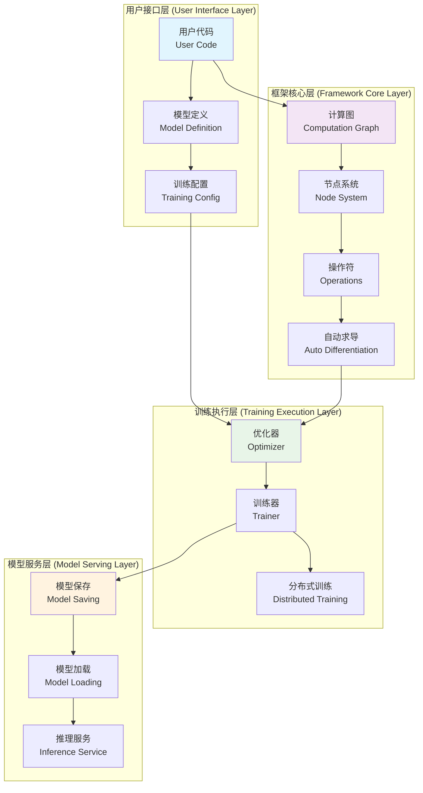
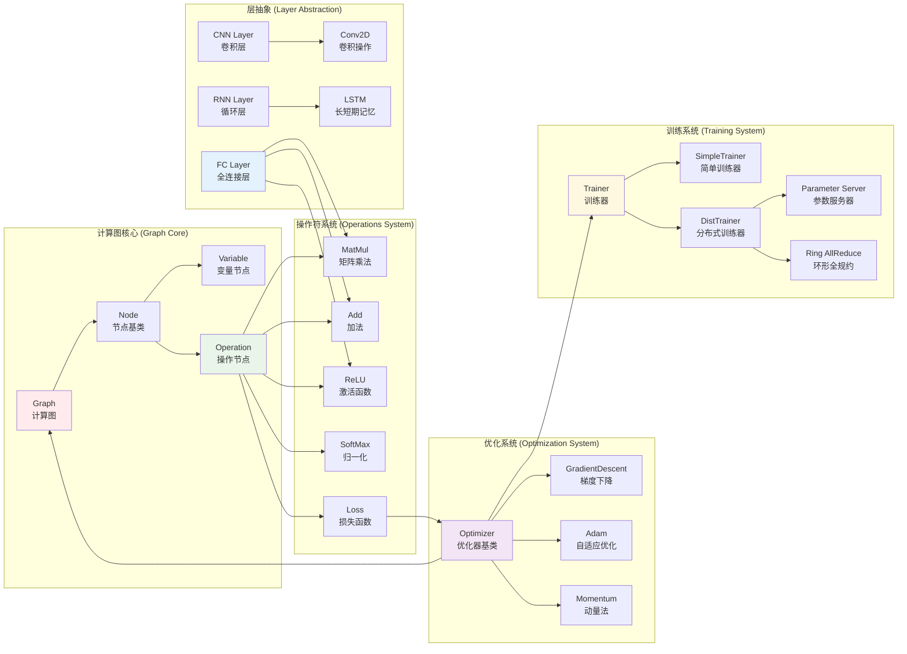
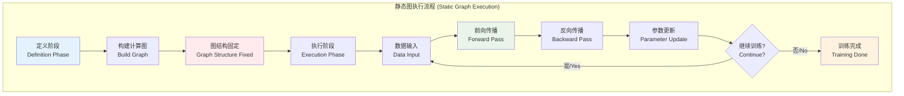
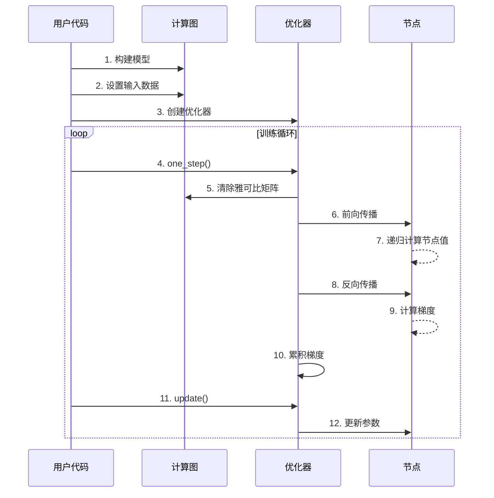
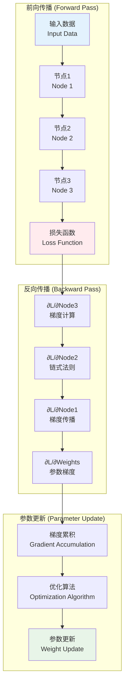
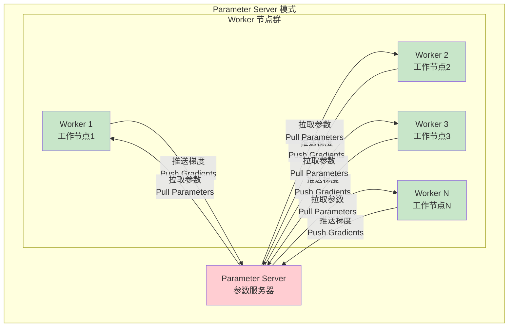
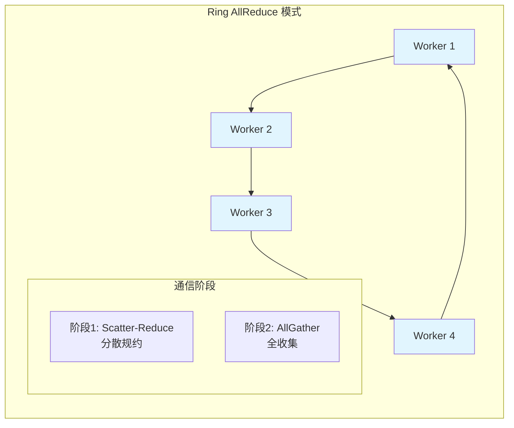

# MatrixSlow 项目识别文档 (Project Identification Document)

## 项目概览 (Project Overview)

**项目名称**: MatrixSlow
**项目类型**: 教学用深度学习框架
**主要语言**: Python
**核心依赖**: NumPy
**代码规模**: ~2K 行核心代码
**设计理念**: 基于计算图的自动求导深度学习框架
**架构模式**: 静态计算图 (Static Computation Graph)
**官方仓库**: [GitHub - MatrixSlow](https://github.com/zc911/MatrixSlow)

## 核心架构 (Core Architecture)

### 整体工作流程图 (Overall Workflow)



### 详细组件关系图 (Detailed Component Relationships)



### 1. 计算图系统 (Computational Graph System)

```
Graph (计算图)
├── nodes: List[Node]           # 节点列表
├── name_scope: str            # 命名空间
└── methods:
    ├── add_node()             # 添加节点
    ├── clear_jacobi()         # 清除雅可比矩阵
    └── reset_value()          # 重置节点值
```

**核心概念**:
- **计算图**: 有向无环图(DAG)，表示计算流程
- **节点**: 计算图中的基本单元，包含操作和变量
- **前向传播**: 从输入到输出计算节点值
- **反向传播**: 计算梯度用于参数更新

### 2. 节点系统 (Node System)

```
Node (抽象基类)
├── parents: List[Node]        # 父节点
├── children: List[Node]       # 子节点
├── value: np.ndarray         # 节点值
├── jacobi: np.ndarray        # 雅可比矩阵
└── methods:
    ├── forward()             # 前向传播
    ├── compute()             # 抽象计算方法
    └── get_jacobi()          # 获取雅可比矩阵

Variable (变量节点) extends Node
├── trainable: bool           # 是否可训练
├── init: bool               # 是否需要初始化
└── dim: tuple               # 维度信息

Operation (操作节点) extends Node
├── MatMul                   # 矩阵乘法
├── Add                      # 加法
├── ReLU                     # ReLU激活
├── Logistic                 # Sigmoid激活
├── SoftMax                  # SoftMax激活
└── Loss Operations          # 损失函数
```

### 3. 计算图执行模式 (Graph Execution Mode)

**MatrixSlow采用静态图模式 (Static Graph)**



**静态图特征分析**:

1. **图构建时机**:
   - 在代码执行时立即构建计算图
   - 节点创建时自动添加到`default_graph`
   - 图结构在训练前完全确定

2. **节点连接方式**:
   ```python
   # 节点创建时立即建立连接关系
   def __init__(self, *parents, **kargs):
       self.parents = list(parents)  # 父节点列表
       self.children = []           # 子节点列表

       # 立即建立父子关系
       for parent in self.parents:
           parent.children.append(self)

       # 立即添加到计算图
       self.graph.add_node(self)
   ```

3. **执行机制**:
   - **定义与执行分离**: 先定义完整图结构，再执行计算
   - **全局计算图**: 使用`default_graph`管理所有节点
   - **固定拓扑**: 图的拓扑结构在训练过程中不变

### 4. 自动求导机制 (Automatic Differentiation)

**实现原理**:
1. **前向传播**: 计算每个节点的输出值
2. **反向传播**: 利用链式法则计算梯度
3. **雅可比矩阵**: 存储偏导数信息
4. **梯度累积**: 支持批量训练

### 训练流程图 (Training Process Flow)



### 自动求导流程图 (Auto Differentiation Flow)



**关键算法**:
```python
# 前向传播伪代码
def forward(node):
    for parent in node.parents:
        if parent.value is None:
            forward(parent)
    node.compute()

# 反向传播伪代码
def backward(node, target):
    if node == target:
        node.jacobi = identity_matrix
    else:
        node.jacobi = sum(child.jacobi @ child.get_jacobi(node)
                         for child in node.children)
```

### 4. 优化器系统 (Optimizer System)

```
Optimizer (抽象基类)
├── graph: Graph              # 计算图
├── target: Node             # 目标节点(损失函数)
├── learning_rate: float     # 学习率
└── methods:
    ├── one_step()           # 单步训练
    ├── forward_backward()   # 前向反向传播
    └── update()             # 参数更新

具体优化器:
├── GradientDescent          # 梯度下降
├── Momentum                 # 动量法
├── AdaGrad                  # AdaGrad
├── RMSProp                  # RMSProp
└── Adam                     # Adam优化器
```

### 5. 层抽象 (Layer Abstraction)

#### 全连接层 (Fully Connected Layer)

**数学原理**:
```
y = W * x + b
```
其中：
- `x`: 输入向量 (input_size × 1)
- `W`: 权重矩阵 (size × input_size)
- `b`: 偏置向量 (size × 1)
- `y`: 输出向量 (size × 1)

**基本实现**:
```python
def fc(input, input_size, size, activation):
    """
    全连接层实现

    参数:
    - input: 输入节点
    - input_size: 输入维度
    - size: 输出维度
    - activation: 激活函数类型 ("ReLU", "Logistic", None)
    """
    # 创建权重和偏置
    weights = Variable((size, input_size), init=True, trainable=True)
    bias = Variable((size, 1), init=True, trainable=True)

    # 线性变换
    affine = Add(MatMul(weights, input), bias)

    # 应用激活函数
    if activation == "ReLU":
        return ReLU(affine)
    elif activation == "Logistic":
        return Logistic(affine)
    else:
        return affine
```

#### ReLU激活函数 (Rectified Linear Unit)

**数学定义**:
```
ReLU(x) = max(0, x) = {
    x,  if x > 0
    0,  if x ≤ 0
}
```

**基本实现**:
```python
class ReLU(Operator):
    """ReLU激活函数节点"""

    def compute(self):
        """前向传播：计算ReLU输出"""
        self.value = np.mat(np.maximum(0, self.parents[0].value))

    def get_jacobi(self, parent):
        """反向传播：计算ReLU的导数"""
        return np.diag(np.where(
            self.parents[0].value.A1 > 0.0, 1.0, 0.0
        ))
```

**特点**:
- **优势**: 计算简单、梯度不饱和、稀疏激活
- **问题**: 可能出现死亡神经元问题
- **应用**: 深度神经网络的标准激活函数

## 关键特性 (Key Features)

### 1. 支持的模型类型
- **线性模型**: 逻辑回归(LR)
- **因子分解机**: FM, DeepFM
- **神经网络**: DNN, CNN, RNN
- **组合模型**: Wide & Deep

### 2. 分布式训练

#### Parameter Server 架构图


#### Ring AllReduce 架构图


- **Parameter Server**: 参数服务器模式
- **Ring AllReduce**: 环形全规约模式
- **通信协议**: gRPC + Protocol Buffers

### 3. 模型服务
- **模型导出**: 支持模型序列化
- **推理服务**: 类似TensorFlow Serving
- **网络协议**: gRPC接口

## 项目结构 (Project Structure)

```
MatrixSlow/
├── matrixslow/                # 核心框架代码
│   ├── core/                  # 计算图和节点
│   │   ├── graph.py          # 计算图实现
│   │   ├── node.py           # 节点基类
│   │   └── core.py           # 核心工具函数
│   ├── ops/                   # 操作符实现
│   │   ├── ops.py            # 基础操作
│   │   ├── loss.py           # 损失函数
│   │   └── metrics.py        # 评估指标
│   ├── optimizer/             # 优化器
│   ├── layer/                 # 层抽象
│   ├── model/                 # 预定义模型
│   ├── trainer/               # 训练器
│   ├── dist/                  # 分布式训练
│   └── util/                  # 工具函数
├── matrixslow_serving/        # 模型服务
├── example/                   # 示例代码
│   ├── ch02/ ~ ch11/         # 按章节组织的示例
└── data/                      # 数据集
```

## 核心算法实现 (Core Algorithm Implementation)

### 矩阵乘法操作
```python
class MatMul(Operator):
    def compute(self):
        self.value = self.parents[0].value * self.parents[1].value

    def get_jacobi(self, parent):
        if parent is self.parents[0]:
            return self.parents[1].value.T
        else:
            return self.parents[0].value.T
```

### 损失函数实现
```python
class CrossEntropyWithSoftMax(Operator):
    def compute(self):
        prob = softmax(self.parents[0].value)
        self.value = -np.sum(self.parents[1].value * np.log(prob + 1e-10))
```

## 使用示例 (Usage Example)

```python
import matrixslow as ms

# 1. 创建输入变量
x = ms.Variable((4, 1), init=False, trainable=False)
y = ms.Variable((3, 1), init=False, trainable=False)

# 2. 构建网络
hidden = ms.layer.fc(x, 4, 10, "ReLU")
output = ms.layer.fc(hidden, 10, 3, None)
loss = ms.ops.loss.CrossEntropyWithSoftMax(output, y)

# 3. 创建优化器
optimizer = ms.optimizer.Adam(ms.default_graph, loss, 0.01)

# 4. 训练循环
for epoch in range(100):
    for batch_x, batch_y in data_loader:
        x.set_value(batch_x)
        y.set_value(batch_y)
        optimizer.one_step()
    optimizer.update()
```

## 静态图特性 (Static Graph Characteristics)

MatrixSlow采用静态计算图模式，具有以下特点：

| 特性 | 静态图 (MatrixSlow) | 动态图 (PyTorch风格) |
|------|-------------------|---------------------|
| **图构建时机** | 定义时立即构建 | 执行时动态构建 |
| **图结构** | 固定不变 | 可动态改变 |
| **调试难度** | 较难调试 | 容易调试 |
| **性能优化** | 便于全局优化 | 优化空间有限 |
| **适用场景** | 固定模型结构 | 动态模型结构 |

**静态图的核心机制**:
- **全局图管理**: 使用`default_graph`统一管理所有节点
- **固定拓扑**: 节点创建时立即建立父子关系
- **分离执行**: 先构建完整模型，再执行训练

## 技术特点 (Technical Characteristics)

### 优势
1. **教学友好**: 代码简洁，注释详细
2. **原理清晰**: 直接体现深度学习核心概念
3. **功能完整**: 支持主流模型和训练方式
4. **易于扩展**: 模块化设计，便于添加新功能
5. **静态图优势**: 便于全局优化和分析

### 限制
1. **性能**: 纯Python实现，运行较慢
2. **张量**: 仅支持二阶张量(矩阵)
3. **优化**: 未进行计算优化
4. **生产**: 主要用于教学，不适合生产环境

## 对其他语言开发者的启示 (Insights for Other Language Developers)

### 1. 核心设计模式
- **计算图**: 使用DAG表示计算流程
- **自动求导**: 基于链式法则的反向传播
- **操作符重载**: 简化数学表达式构建

### 2. 架构设计原则
- **分层抽象**: 节点->操作->层->模型
- **职责分离**: 计算图、优化器、训练器独立
- **可扩展性**: 通过继承添加新操作和优化器

### 3. 实现要点
- **内存管理**: 及时清理中间结果
- **数值稳定**: 处理梯度消失/爆炸
- **并行化**: 支持分布式训练

---

## 总结 (Summary)

MatrixSlow是一个优秀的深度学习框架教学实现，通过简洁的代码展示了现代深度学习框架的核心原理。其静态计算图设计、自动求导机制和分层抽象为理解深度学习框架内部机制提供了极好的学习资源。

**核心价值**:
- **教育意义**: 帮助理解深度学习框架的基本原理
- **设计参考**: 为其他语言的深度学习框架开发提供思路
- **技术示范**: 展示了计算图、自动求导等关键技术的实现方法