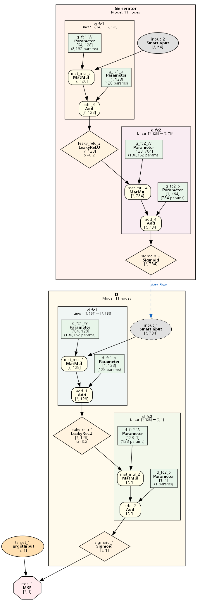

## 这是啥？

一个用纯 Rust（不用 C++）打造的仿 Pytorch 的玩具型 AI 框架（目前尚不成熟，请勿使用）。该项目不打算支持 GPU--因后期可能要支持安卓等平台，不想受制于某（几）种非 CPU 设备。但可能会加入 NEAT 等网络进化的算法。

### 名字由来

一部分原因是受到 pytorch 的影响，希望能写个和 pytorch 一样甚至更易用的 AI 框架；另一部分是希望本框架只触及（touch）一些关键的东西：

- only torch Rust --- 只用 Rust（不用 C++是因为其在复杂逻辑项目中容易写出内存不安全代码）；也不打算支持 Python 接口）；亦不用第三方 lib（所以排除[tch-rs](https://github.com/LaurentMazare/tch-rs)），这样对跨平台支持会比较友好。
- only torch CPU --- 不用 GPU，因要照顾多平台也不想被某个 GPU 厂商制约，且基于 NEAT 进化的网络结构也不太好被 GPU 优化（也省得考虑数据从 CPU 的堆栈迁移到其他设备内存的开销问题了）。
- only torch node --- 没有全连接、卷积、resnet 这类先入为主的算子概念，具体模型结构均基于 NEAT 进化。
- only torch tensor --- 所有的数据类型都是内置类型 tensor（实现可能会参考[peroxide](https://crates.io/crates/peroxide)），不需要第三方处理库，如[numpy](https://github.com/PyO3/Rust-numpy)，[array](https://doc.Rust-lang.org/std/primitive.array.html)或[openBLAS](https://github.com/xianyi/OpenBLAS/wiki/User-Manual)（[关于 blas 的一些说明](https://blog.csdn.net/u013677156/article/details/77865405)）。
- only torch f32 --- 网络的参数（包括模型的输入、输出）不需要除了 f32 外的数据类型。

### 计算图可视化

框架内置 Graphviz 可视化支持，可自动生成计算图结构图（需安装 [Graphviz](https://graphviz.org/)）：

<details>
<summary>📊 MNIST GAN 计算图示例（点击展开）</summary>



> Generator + Discriminator 共 210,065 参数，展示 `detach` 梯度控制与多 Loss 训练

</details>

```rust
// 生成可视化
graph.save_visualization("model.png", None)?;
// 或导出 DOT 格式
let dot = graph.to_dot();
```

## 文档

目前无人性化的文档。可直接看 Rust 自动生成的[Api Doc](https://docs.rs/only_torch)即可。

### 使用示例

> 所有示例均采用 **PyTorch 风格 API**，使用 `ModelState` + `Criterion` 智能缓存机制。
> 运行方式：`cargo run --example <名称>` 或 `just example-<名称>`

#### 示例概览

| 示例 | 任务类型 | 核心特性 | 网络结构 | 运行命令 |
|------|---------|---------|---------|---------|
| [xor](examples/xor/) | 二分类 | Linear 层、Tanh 激活 | `2 → 4 → 1` | `cargo run --example xor` |
| [iris](examples/iris/) | 多分类 | CrossEntropyLoss、真实数据集 | `4 → 8 → 3` | `cargo run --example iris` |
| [sine_regression](examples/sine_regression/) | 回归 | MseLoss、函数拟合 | `1 → 32 → 1` | `cargo run --example sine_regression` |
| [california_housing](examples/california_housing/) | 回归 | MseLoss、真实数据集、DataLoader | `8 → 128 → 64 → 32 → 1` | `cargo run --example california_housing` |
| [mnist](examples/mnist/) | 图像分类 | CNN、MaxPool、大规模数据 | LeNet 风格 | `cargo run --example mnist` |
| [parity_rnn_fixed_len](examples/parity_rnn_fixed_len/) | 序列分类 | **RNN 层**、固定长度序列 | `RNN(1→16) → FC(2)` | `cargo run --example parity_rnn_fixed_len` |
| [parity_rnn_var_len](examples/parity_rnn_var_len/) | 序列分类 | **RNN 层**、变长序列、BucketedDataLoader | `RNN(1→16) → FC(2)` | `cargo run --example parity_rnn_var_len` |
| [parity_lstm_var_len](examples/parity_lstm_var_len/) | 序列分类 | **LSTM 层**、变长序列 | `LSTM(1→16) → FC(2)` | `cargo run --example parity_lstm_var_len` |
| [parity_gru_var_len](examples/parity_gru_var_len/) | 序列分类 | **GRU 层**、变长序列 | `GRU(1→16) → FC(2)` | `cargo run --example parity_gru_var_len` |

#### 详细说明

<details>
<summary><b>基础示例</b>（点击展开）</summary>

**XOR 异或问题** ⭐

经典非线性分类问题，验证神经网络学习非线性函数的能力。

```bash
cargo run --example xor
# 约 100 epoch 达到 100% 准确率
```

**Iris 鸢尾花分类** ⭐

使用经典 Iris 数据集进行三分类，展示 `CrossEntropyLoss` 在多分类任务中的使用。

```bash
cargo run --example iris
# 约 200 epoch 达到 96%+ 准确率
```

</details>

<details>
<summary><b>回归示例</b>（点击展开）</summary>

**正弦函数拟合**

拟合 `y = sin(x)`，展示 `MseLoss` 在回归任务中的基本使用。

```bash
cargo run --example sine_regression
# 500 epoch 后最大误差 < 0.1
```

**California Housing 房价预测** ⭐⭐

使用真实房价数据集（20,000+ 样本），展示：
- `ModelState` 模型状态管理
- `MseLoss` 损失函数
- `DataLoader` 批量加载
- R² 评估指标

```bash
cargo run --example california_housing
# 约 11 epoch 达到 R² ≥ 70%
```

</details>

<details>
<summary><b>图像分类示例</b>（点击展开）</summary>

**MNIST 手写数字识别** ⭐⭐⭐

基于 LeNet 风格的 CNN 架构，展示：
- `Conv2d` 卷积层
- `MaxPool2d` / `AvgPool2d` 池化层
- 大规模图像数据处理

```bash
cargo run --example mnist
# 达到 90%+ 准确率
```

</details>

<details>
<summary><b>序列/RNN 示例</b>（点击展开）</summary>

**RNN 奇偶性检测（固定长度）**

判断二进制序列中 1 的个数是奇数还是偶数，展示 RNN 层的基本使用。

```bash
cargo run --example parity_rnn_fixed_len
# 固定 seq_len=10，达到 95%+ 准确率
```

**RNN 奇偶性检测（变长序列）** ⭐⭐

展示 **变长序列** 处理的完整流程：
- `VarLenDataset` + `BucketedDataLoader` 分桶加载
- `ModelState` 按形状智能缓存
- `CrossEntropyLoss` 按输出节点智能缓存

```bash
cargo run --example parity_rnn_var_len
# 混合 seq_len=5/7/10，达到 90%+ 准确率
```

**LSTM/GRU 变长序列** ⭐⭐

与 RNN 版本相同的任务，但使用 LSTM/GRU 层展示不同循环单元的使用。

```bash
cargo run --example parity_lstm_var_len
cargo run --example parity_gru_var_len
```

</details>

#### 特性覆盖矩阵

| 特性 | xor | iris | sine | california | mnist | parity* |
|------|:---:|:----:|:----:|:----------:|:-----:|:-------:|
| `Linear` 层 | ✅ | ✅ | ✅ | ✅ | ✅ | ✅ |
| `Conv2d` 层 | | | | | ✅ | |
| `RNN/LSTM/GRU` 层 | | | | | | ✅ |
| `ModelState` | ✅ | ✅ | ✅ | ✅ | ✅ | ✅ |
| `CrossEntropyLoss` | ✅ | ✅ | | | ✅ | ✅ |
| `MseLoss` | | | ✅ | ✅ | | |
| `DataLoader` | | ✅ | | ✅ | ✅ | |
| `BucketedDataLoader` | | | | | | ✅ |
| 变长序列 | | | | | | ✅ |

> **底层测试**：如需了解框架底层机制（手动构建计算图、自动微分原理等），可参考 `tests/` 目录下的单元测试和 `tests/archive/` 下的早期集成测试。

### 性能提示

如果在 **debug 模式**下使用 CNN 等计算密集功能，建议在 `Cargo.toml` 中添加：

```toml
[profile.dev.package."*"]
opt-level = 3
```

这会对所有依赖库（`ndarray`、`rayon` 等）开启最大优化，显著提升 debug 模式下的运行速度，同时保持你自己的代码可调试。

> **适用场景**：
>
> - 开发本项目时（开发者）
> - 将本项目作为 crate 依赖导入到你自己的项目时（用户）
>
> **注意**：此设置仅影响当前项目的构建行为。当你把 `only_torch` 作为依赖使用时，需要在**你自己的项目**的 `Cargo.toml` 中添加此配置才能生效。

## TODO

> 按优先级排序（最重要的在最前面）

### 🔴 核心功能

- 记忆/循环机制（详见 [设计文档](.doc/design/memory_mechanism_design.md)）
  - Phase 4: NEAT 集成

### 🔵 NEAT 相关（长期目标）

- 动态节点添加机制完善:
  - 后期当引入 NEAT 机制后，可以给已存在节点添加父子节点后，需要把现有节点检测再完善下；
  - 当后期（NEAT 阶段）需要在一个已经 forwarded 的图中添加节点（如将已经被使用过的 var1、var2 结合一个新的未使用的 var3 构建一个 add 节点），可能需要添加一个 `reset_forward_cnt` 方法来保证图 forward 的一致性。
- `reset_forward_cnt` 方法（支持已 forward 图的节点扩展）
- 根据 matrixSlow+我笔记重写全部实现！保证可以后期以 NEAT 进化，能 ok 拓展至 linear 等常用层，容易添加 edge（如已存在的 add 节点的父节点）。

### ⚫ 实战验证

- 深度强化学习：CartPole（需 Gym 支持）
- [CFC](https://github.com/raminmh/CfC) 实现

### 💤 低优先级

- backward 逻辑的 AI 辅助优化

## 笔记

### 核心概念：维度与张量体系

| 术语         | 英文   | 维数(ndim) | shape 示例 | 说明                   |
| ------------ | ------ | ---------- | ---------- | ---------------------- |
| 标量(scalar) | scalar | 0          | `[]`       | 单个数值，无维度       |
| 向量(vector) | vector | 1          | `[n]`      | 1 维数组               |
| 矩阵(matrix) | matrix | 2          | `[m, n]`   | 2 维数组，m 行 n 列    |
| 张量(tensor) | tensor | ≥0         | 任意       | 泛指，包含以上所有类型 |

> **维数(ndim)**：张量有几个轴（shape 长度）。**维度(dim)**：指定某个轴进行操作。本项目统一使用"维度"术语，与 PyTorch 保持一致。

详见：[术语规范](.doc/terminology_convention.md)

### 设计文档

- [广播机制设计决策](.doc/design/broadcast_mechanism_design.md) - 阐述了为何采用"显式节点广播"而非 PyTorch 风格隐式广播，及其对 NEAT 演化、梯度计算的影响
- [性能优化策略](.doc/design/optimization_strategy.md) - 针对 CPU-only 和 NEAT 小规模不规则网络的优化方向，包括个体并行、Batch 向量化、SIMD 等策略的优先级分析
- [性能优化候选项](.doc/optimization_candidates.md) - 待 benchmark 验证的具体优化点记录
- [本项目的梯度设计机制说明](.doc/design/gradient_clear_and_accumulation_design.md) - 详细说明了梯度/雅可比矩阵相关的设计决策，包括手动清除梯度的原理、累计机制等的使用模式和最佳实践
- [梯度流控制机制](.doc/design/gradient_flow_control_design.md) - `no_grad`、`detach`、`retain_graph` 三种梯度控制机制的设计，包括 GAN、Actor-Critic、多任务学习等高级训练模式
- [DataLoader 使用指南](.doc/design/data_loader_design.md) - PyTorch 风格的数据批量加载器，支持 `TensorDataset`、自动分批、shuffle、drop_last 等功能
- [Batch Forward/Backward 机制设计](.doc/design/batch_mechanism_design.md) - 批量训练机制的设计决策，包括 Gradient-based 反向传播、API 设计、性能优化（约 18x 加速）等
- [Graph 序列化与可视化设计](.doc/design/graph_serialization_design.md) - 统一的图描述层（IR）设计，支持模型保存/加载（JSON+bin）、Graphviz 可视化、Keras 风格 summary 输出
- [计算图可视化指南](.doc/design/visualization_guide.md) - 可视化 API 使用指南、节点/边样式说明、循环层时间步标注、最佳实践
- [记忆/循环机制设计](.doc/design/memory_mechanism_design.md) - NEAT 风格循环与传统 RNN 循环的关系、Hybrid 设计方案、BPTT/TBPTT 训练策略、实现路径及相关论文
- [神经架构演化设计](.doc/design/neural_architecture_evolution_design.md) - **核心特色**：NEAT 风格拓扑变异 + 梯度训练的混合策略，包括变异操作、收敛判定、Lamarckian 权重继承
- [未来功能规划](.doc/design/future_enhancements.md) - 多输入/多输出扩展、过程宏简化等未来功能的设计规划
- [MatrixSlow 项目识别文档](.doc/reference/python_MatrixSlow_pid.md) - 基于 MatrixSlow 的 Python 深度学习框架分析，包含计算图、自动求导、静态图执行等核心概念的详细说明

## 参考资料

### 训练用数据集（包括强化学习 gym）

- [Mnist](http://yann.lecun.com/exdb/mnist/)
- [FashionMnist](https://www.kaggle.com/datasets/zalando-research/fashionmnist?resource=download)
- [ChineseMnist](https://www.kaggle.com/datasets/gpreda/chinese-mnist)
- [训练用的各种数据集（包括强化学习）](https://huggingface.co/FUXI)
- [bevy_rl](https://crates.io/crates/bevy_rl)
- [pure_rust_gym](https://github.com/MathisWellmann/gym-rs/tree/master)
- [老式游戏 rom](https://www.myabandonware.com/)

### 数学/IT 原理

- [早期 pytorch 关于 Tensor、Variable 等的探讨](https://pytorch.org/blog/pytorch-0_4_0-migration-guide/#merging-tensor-and-variable-and-classes)
- [矩阵和向量的各种乘法](https://www.jianshu.com/p/9165e3264ced)
- [神经网络与记忆](https://www.bilibili.com/video/BV1fV4y1i7hZ/?spm_id_from=333.1007.0.0&vd_source=3facc3cb195be0a27a0ea9a4eb3bb6fe)
- [陈天奇的机器学习编译课](https://www.bilibili.com/video/BV15v4y1g7EU/?is_story_h5=false&p=1&share_from=ugc&share_medium=android&share_plat=android&share_session_id=5a312434-ccf7-4cb9-862a-17a601cc4d35&share_source=COPY&share_tag=s_i&timestamp=1661386914&unique_k=zCWMKGC&vd_source=3facc3cb195be0a27a0ea9a4eb3bb6fe)
- [基于梯度的机器学习 IT 原理](https://zhuanlan.zhihu.com/p/518198564)

### 开源示例

- [KAN 2.0](https://blog.csdn.net/qq_44681809/article/details/141355718)
- [radiate--衍生 NEAT 的纯 Rust 库](https://github.com/pkalivas/radiate)
- [neat-rs](https://github.com/dbsxdbsx/neat-rs)
- [纯 Rust 的 NEAT+GRU](https://github.com/sakex/neat-gru-Rust)
- [Rusty_sr-纯 Rust 的基于 dl 的图像超清](https://github.com/millardjn/Rusty_sr)
- [ndarray_glm(可参考下 `array!`，分布，以及原生的 BLAS)](https://docs.rs/ndarray-glm/latest/ndarray_glm/)
- [PyToy--基于 MatrixSlow 的 Python 机器学习框架](https://github.com/ysj1173886760/PyToy)
- [MatrixSlow--纯 python 写的神经网络库](https://github.com/zc911/MatrixSlow)
- [python：遗传算法（GE）玩 FlappyBird](https://github.com/ShuhuaGao/gpFlappyBird)
- [python 包：遗传规划 gplearn](https://gplearn.readthedocs.io/en/stable/examples.html)
- [python 包：遗传规划 deap](https://deap.readthedocs.io/en/master/examples/gp_symbreg.html)
- [python 包：特征自动提取](https://github.com/IIIS-Li-Group/OpenFE)
- [NTK 网络](https://zhuanlan.zhihu.com/p/682231092)

（较为成熟的 3 方库）

- [Burn—纯 rust 深度学习库](https://github.com/Tracel-AI/burn)
- [Candle:纯 rust 较成熟的机器学习库](https://github.com/huggingface/candle)
- [用纯 numpy 写各类机器学习算法](https://github.com/ddbourgin/numpy-ml)
  （自动微分参考）
- [手工微分：Rust-CNN](https://github.com/goldstraw/RustCNN)
- [neuronika--纯 Rust 深度学习库（更新停滞了，参考下自动微分部分）](https://github.com/neuronika/neuronika)
- [基于 TinyGrad 的 python 深度学习库的 RL 示例](https://github.com/DHDev0/TinyRL/tree/main)
- [重点：Rust- ---支持 cuda 的 Rust 深度学习库(参考下自动微分部分)](https://docs.rs/dfdx/latest/dfdx/)
- [重点：基于 ndarray 的反向 autoDiff 库](https://github.com/raskr/rust-autograd)
- [前向 autoDiff(貌似不成熟)](https://github.com/elrnv/autodiff)
- []
- [深度学习框架 InsNet 简介](https://zhuanlan.zhihu.com/p/378684569)
- [C++机器学习库 MLPACK](https://www.mlpack.org/)
- [经典机器学习算法 Rust 库](https://github.com/Rust-ml/linfa)
- [peroxide--纯 Rust 的线代及周边库](https://crates.io/crates/peroxide)
- [C++实现的 NEAT+LSTM/GRU/CNN](https://github.com/travisdesell/exact)
- [pytorch+NEAT](https://github.com/ddehueck/pytorch-neat)
- [avalog--基于 avatar 的 Rust 逻辑推理库](https://crates.io/crates/avalog)

### NEAT、神经架构进化

- [用梯度指导神经架构进化：Splitting Steepest Descent](https://www.cs.utexas.edu/~qlearning/project.html?p=splitting)
- [Deep Mad，将卷积网络设计为一个数学建模问题](https://www.bilibili.com/video/BV1HP411R74T/?spm_id_from=333.999.0.0&vd_source=3facc3cb195be0a27a0ea9a4eb3bb6fe)
- [动态蛇形卷积 DSCNet](https://www.bilibili.com/video/BV1J84y1d7yG/?spm_id_from=333.1007.0.0&vd_source=3facc3cb195be0a27a0ea9a4eb3bb6fe)
- [autoML 介绍](https://www.zhihu.com/question/554255720/answer/2750670583)

### 符号派：逻辑/因果推断
- [逻辑/因果推断相关书籍](.doc/reference/logic_books.md)
- [scryer-prolog--Rust 逻辑推理库](https://github.com/mthom/scryer-prolog)
- [vampire:自动证明器](https://github.com/vprover/vampire?tab=readme-ov-file)
- [那迷人的被遗忘的语言：Prolog](https://zhuanlan.zhihu.com/p/41908829)
- [结合 prolog 和 RL](https://arxiv.org/abs/2004.06997)
- [prolog 与 4 证人难题](https://prolog.longluntan.com/t9-topic)
- [logic+mL 提问](https://ai.stackexchange.com/questions/16224/has-machine-learning-been-combined-with-logical-reasoning-for-example-prolog)
- [prolog 解决数独问题](https://prolog.longluntan.com/t107-topic)
- [贝叶斯与逻辑推理](https://stats.stackexchange.com/questions/243746/what-is-probabilistic-inference)
- [用一阶逻辑辅佐人工神经网络](https://www.cs.cmu.edu/~hovy/papers/16ACL-NNs-and-logic.pdf)
- [二阶逻辑杂谈](https://blog.csdn.net/VucNdnrzk8iwX/article/details/128928166)
- [关于二阶逻辑的概念问题](https://www.zhihu.com/question/321025032/answer/702580771?utm_id=0)
- [PWL:基于贝叶斯的自然语言处理](https://github.com/asaparov/PWL)
- [Symbolic Learning Enables Self-Evolving Agents](https://arxiv.org/abs/2406.18532)
- ASTRID 系统（Mind|Construct, 2017）
- 归纳逻辑编程（Inductive Logic Programming, ILP）
- 书：《The Book of Why》
- 书：《Causality:Models,Reasoning,and Inference》
- [知乎：因果推断杂谈](https://www.zhihu.com/question/266812683/answer/895210894)
- [信息不完备下基于贝叶斯推断的可靠度优化方法](https://www.docin.com/p-2308549828.html)
- [贝叶斯网络中的因果推断](https://www.docin.com/p-1073204271.html?docfrom=rrela)

### 神经网络的可解释性

- [可解释性核心——神经网络的知识表达瓶颈](https://zhuanlan.zhihu.com/p/422420088/)
- [神经网络可解释性：论统一 14 种输入重要性归因算法](https://zhuanlan.zhihu.com/p/610774894/)
- [神经网络的可解释性](https://zhuanlan.zhihu.com/p/341153242)
- [可解释的哈萨尼网络](https://zhuanlan.zhihu.com/p/643213054)

### 超参数优化

- [mle-hyperopt](https://github.com/mle-infrastructure/mle-hyperopt)

### CPU 加速

- [SLIDE](https://arxiv.org/abs/2103.10891)
- [Rust+AVX](https://medium.com/@Razican/learning-simd-with-Rust-by-finding-planets-b85ccfb724c3)
- [矩阵加速-GEMM](https://www.jianshu.com/p/6d3f013d8aba)

### 强化学习

- [Sac 用以复合 Action](https://arxiv.org/pdf/1912.11077v1.pdf)
- [EfficientZero](https://arxiv.org/abs/2111.00210)
- [EfficientZero Remastered](https://www.gigglebit.net/blog/efficientzero)
- [EfficientZero V2: Mastering Discrete and Continuous Control with Limited Data](https://arxiv.org/abs/2403.00564v2)
- [SpeedyZero](https://openreview.net/forum?id=Mg5CLXZgvLJ)
- [LightZero 系列](https://github.com/opendilab/LightZero?tab=readme-ov-file)
- [随机 MuZero 代码](https://github.com/DHDev0/Stochastic-muzero)
- [Redeeming Intrinsic Rewards via Constrained Optimization](https://williamd4112.github.io/pubs/neurips22_eipo.pdf)
- [Learning Reward Machines for Partially Observable Reinforcement Learning](https://arxiv.org/abs/2112.09477)
- [combo 代码](https://github.com/Shylock-H/COMBO_Offline_RL)
- [2023 最新 model-based offline 算法：MOREC](https://arxiv.org/abs/2310.05422)
- [众多 model-base/free 的 offline 算法](https://github.com/yihaosun1124/OfflineRL-Kit)
- [model-free offline 算法：MCQ 解析](https://zhuanlan.zhihu.com/p/588444380)
- [RL 论文列表（curiosity、offline、uncertainty，safe）](https://github.com/yingchengyang/Reinforcement-Learning-Papers)
- [代替 Gym 的综合库](https://gymnasium.farama.org/)

### rust+大语言模型（LLM）

- [BionicGpt](https://github.com/bionic-gpt/bionic-gpt)
- [适用对话的 Rust 终端 UI？](https://dustinblackman.com/posts/oatmeal/)
- [chatGpt 相关论文](https://arxiv.org/abs/2203.02155)

### （自动、交互式）定理证明

- [关于 lean 的一篇文章](https://zhuanlan.zhihu.com/p/183902909#%E6%A6%82%E8%A7%88)
- [Lean+LLM](https://github.com/lean-dojo/LeanDojo)
- [陶哲轩使用 Lean4](https://mp.weixin.qq.com/s/TYB6LgbhjvHYvkbWrEoDOg)

```
Formal Verification
├── Theorem Proving（定理证明）
│   ├── Interactive Theorem Proving（交互式）
│   │   ├── Coq
│   │   ├── Lean
│   │   └── Isabelle/HOL
│   └── Automated Theorem Proving（自动式）
└── Model Checking（模型检测）
```

### 博弈论（game）

- [Sprague-Grundy 介绍 1](https://zhuanlan.zhihu.com/p/157731188)
- [Sprague-Grundy 介绍 2](https://zhuanlan.zhihu.com/p/20611132)
- [Sprague-Grundy 介绍 3](https://zhuanlan.zhihu.com/p/357893255)

### 其他

- [动手学深度学习-李沐著](https://zh-v2.d2l.ai/chapter_preliminaries/linear-algebra.html#subsec-lin-algebra-norms)
- [openMMLab-Yolo](https://github.com/open-mmlab/mmyolo)
- [GRU 解释](https://www.pluralsight.com/guides/lstm-versus-gru-units-in-rnn)
- [基于人类语音指挥的 AI](https://arxiv.org/abs/1703.09831)
- [webGPT 会上网的 gpt](https://arxiv.org/abs/2112.09332)
- [LeCun 的自监督世界模型](https://zhuanlan.zhihu.com/p/636997984)
- [awesome Rust](https://github.com/Rust-unofficial/awesome-Rust#genetic-algorithms)
- [去雾算法](https://blog.csdn.net/IT_job/article/details/78864236)
- [rust 人工智能相关的项目](https://github.com/rust-unofficial/awesome-rust#artificial-intelligence)
- [《千脑智能》及相关 github 项目](https://www.numenta.com/thousand-brains-project/)

## 遵循协议

本项目遵循 MIT 协议（简言之：不约束，不负责）。
