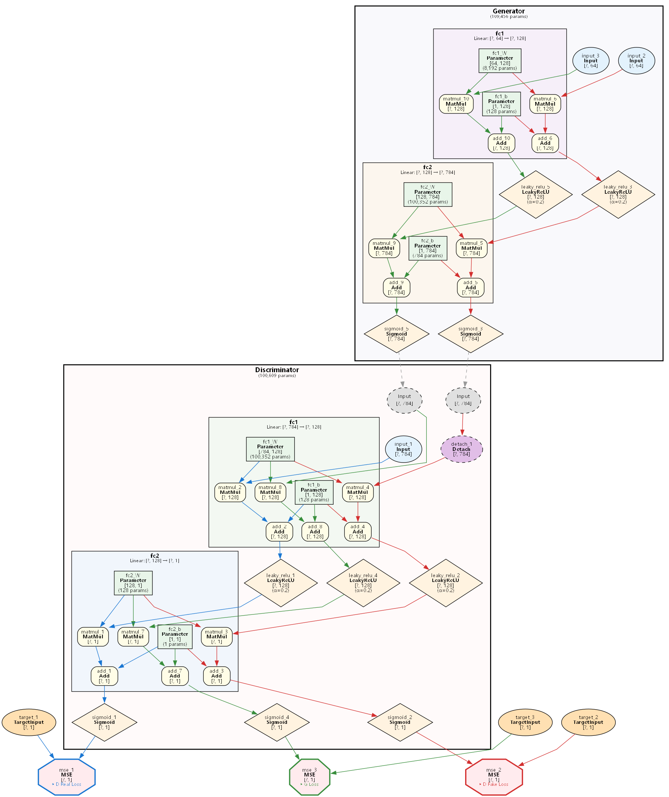

## 这是啥？

一个用纯 Rust（不用 C++）打造的仿 Pytorch 的玩具型 AI 框架（目前尚不成熟，请勿使用）。该项目不打算支持 GPU--因后期可能要支持安卓等平台，不想受制于某（几）种非 CPU 设备。已实现 NEAT 风格的神经架构演化系统，具备 NodeLevel 统一内核、Pareto/NSGA-II 多目标搜索、ONNX 互通、Feature Map 粒度演化、Net2Net 函数保持性变异、ASHA 多保真评估等能力，可从最小网络自动搜索最优架构。

### 名字由来

一部分原因是受到 pytorch 的影响，希望能写个和 pytorch 一样甚至更易用的 AI 框架；另一部分是希望本框架只触及（touch）一些关键的东西：

- only torch Rust --- 只用 Rust（不用 C++是因为其在复杂逻辑项目中容易写出内存不安全代码）；也不打算支持 Python 接口）；亦不用第三方 lib（所以排除[tch-rs](https://github.com/LaurentMazare/tch-rs)），这样对跨平台支持会比较友好。
- only torch CPU --- 不用 GPU，因要照顾多平台也不想被某个 GPU 厂商制约，且基于 NEAT 进化的网络结构也不太好被 GPU 优化（也省得考虑数据从 CPU 的堆栈迁移到其他设备内存的开销问题了）。
- only torch node --- 没有全连接、卷积、resnet 这类先入为主的算子概念，具体模型结构均可基于 NEAT 演化自动发现（已有 MVP 实现）。
- only torch tensor --- 所有的数据类型都是内置类型 tensor，默认不依赖第三方数值库。可通过 feature flag 可选启用 [Intel MKL](https://www.intel.com/content/www/us/en/developer/tools/oneapi/onemkl.html) 或 [OpenBLAS](https://github.com/xianyi/OpenBLAS) 加速矩阵运算（约 15% 训练提速）。
- only torch f32 --- 网络的参数（包括模型的输入、输出）不需要除了 f32 外的数据类型。

### 计算图可视化

框架内置 Graphviz 可视化支持，可自动生成计算图结构图（需安装 [Graphviz](https://graphviz.org/)）：

<details>
<summary>📊 MNIST GAN 计算图示例（点击展开）</summary>



> Generator + Discriminator 共 210,065 参数，展示 `detach` 梯度控制与多 Loss 训练

</details>

```rust
// 生成可视化
graph.save_visualization("model.png", None)?;
// 或导出 DOT 格式
let dot = graph.to_dot();
```

## 文档

目前无人性化的文档。可直接看 Rust 自动生成的[Api Doc](https://docs.rs/only_torch)即可。

### 使用示例

> 所有示例均采用 **PyTorch 风格动态图 API**（`Graph` + `Var` + `Module` + `Optimizer`），训练循环简洁直观。
> 运行方式：`cargo run --example <名称>` 或 `just example-<名称>`

#### 示例概览

| 示例 | 任务类型 | 核心特性 | 网络结构 | 运行命令 |
|------|---------|---------|---------|---------|
| [xor](examples/traditional/xor/) | 二分类 | Linear 层、Tanh 激活 | `2 → 4 → 1` | `cargo run --example xor` |
| [iris](examples/traditional/iris/) | 多分类 | CrossEntropyLoss、真实数据集 | `4 → 8 → 3` | `cargo run --example iris` |
| [sine_regression](examples/traditional/sine_regression/) | 回归 | MseLoss、函数拟合 | `1 → 32 → 1` | `cargo run --example sine_regression` |
| [california_housing](examples/traditional/california_housing/) | 回归 | MseLoss、真实数据集、DataLoader | `8 → 128 → 64 → 32 → 1` | `cargo run --example california_housing` |
| [mnist](examples/traditional/mnist/) | 图像分类 | MLP、Dropout、大规模数据 | `784 → 128 → 10` | `cargo run --example mnist` |
| [mnist_cnn](examples/traditional/mnist_cnn/) | 图像分类 | **CNN**、Conv2d、MaxPool2d | LeNet 风格 `Conv(1→4→8)` | `cargo run --example mnist_cnn` |
| [single_object_segmentation](examples/traditional/single_object_segmentation/) | 单目标语义分割 | **Pixel-wise BCE**、IoU、空间输出 | `Conv(1→4→4→1)` | `cargo run --example single_object_segmentation` |
| [single_object_detection](examples/traditional/single_object_detection/) | 单目标检测 | **bbox 回归**、Mean Box IoU、预测框可视化 | `Conv → Pool → FC(4)` | `cargo run --example single_object_detection` |
| [mnist_gan](examples/traditional/mnist_gan/) | **图像生成** | **GAN**、detach 梯度控制、多 Loss | `G(64→256→784) D(784→256→1)` | `cargo run --example mnist_gan` |
| [parity_rnn_fixed_len](examples/traditional/parity_rnn_fixed_len/) | 序列分类 | **RNN 层**、固定长度序列 | `RNN(1→16) → FC(2)` | `cargo run --example parity_rnn_fixed_len` |
| [parity_rnn_var_len](examples/traditional/parity_rnn_var_len/) | 序列分类 | **RNN 层**、变长序列、BucketedDataLoader | `RNN(1→16) → FC(2)` | `cargo run --example parity_rnn_var_len` |
| [parity_lstm_var_len](examples/traditional/parity_lstm_var_len/) | 序列分类 | **LSTM 层**、变长序列 | `LSTM(1→16) → FC(2)` | `cargo run --example parity_lstm_var_len` |
| [parity_gru_var_len](examples/traditional/parity_gru_var_len/) | 序列分类 | **GRU 层**、变长序列 | `GRU(1→16) → FC(2)` | `cargo run --example parity_gru_var_len` |
| [dual_input_add](examples/traditional/dual_input_add/) | 回归 | **多输入**、特征融合 | `2×Linear → Concat → 1` | `cargo run --example dual_input_add` |
| [siamese_similarity](examples/traditional/siamese_similarity/) | 二分类 | **多输入**、共享编码器 | `共享Encoder → Concat → 1` | `cargo run --example siamese_similarity` |
| [dual_output_classify](examples/traditional/dual_output_classify/) | 多任务 | **多输出**、多 Loss 训练 | `Shared → (Cls, Reg)` | `cargo run --example dual_output_classify` |
| [multi_io_fusion](examples/traditional/multi_io_fusion/) | 多任务 | **多输入+多输出**、特征融合 | `2×Enc → Fusion → (Cls, Reg)` | `cargo run --example multi_io_fusion` |
| [multi_label_point](examples/traditional/multi_label_point/) | **多标签分类** | **BceLoss**、multi_label_accuracy | `2 → 16 → 16 → 4` | `cargo run --example multi_label_point` |
| [cartpole_sac](examples/traditional/sac/cartpole/) | **强化学习** | **SAC-Discrete**、GymEnv、经验回放 | `Actor-Critic(4→64→2)` | `cargo run --example cartpole_sac` |
| [pendulum_sac](examples/traditional/sac/pendulum/) | **强化学习** | **SAC-Continuous**、TanhNormal、动作缩放 | `Actor(3→32→mean+std) Critic(4→32→1)` | `cargo run --example pendulum_sac` |
| [moving_sac](examples/traditional/sac/moving/) | **强化学习** | **Hybrid SAC**、独立连续分支、双温度 | `Actor(10→256→离散+连续) Critic(12→256→3)` | `cargo run --example moving_sac` |
| [chess_cnn_onnx_finetune](examples/traditional/chess_cnn_onnx_finetune/) | 图像分类 | **ONNX 互通**、CNN、继续训练、.otm 保存/加载 | `Conv(3→16→32) FC(1568→128→15)` | `cargo run --example chess_cnn_onnx_finetune` |
| [chess_yolo_onnx_detect](examples/traditional/chess_yolo_onnx_detect/) | 目标检测 → FEN | **第三方真实 YOLOv5 ONNX**、整盘识别 → 标准 FEN | YOLOv5 (~7M 参数) | `cargo run --example chess_yolo_onnx_detect` |
| [evolution_xor](examples/evolution/xor/) | **神经架构演化** | **Evolution API**、零模型代码、自动架构搜索 | 自动演化 | `cargo run --example evolution_xor` |
| [evolution_iris](examples/evolution/iris/) | **神经架构演化** | **Evolution API**、mini-batch、三分类 | 自动演化 | `cargo run --example evolution_iris` |
| [evolution_mnist](examples/evolution/mnist/) | **神经架构演化** | **Evolution API**、Spatial 域 CNN 自动搜索 | 自动演化 | `cargo run --example evolution_mnist` |
| [evolution_parity_seq](examples/evolution/parity_seq/) | **神经架构演化** | **Evolution API**、序列数据、记忆单元自动选择 | 自动演化 | `cargo run --example evolution_parity_seq` |
| [evolution_parity_seq_var_len](examples/evolution/parity_seq_var_len/) | **神经架构演化** | **Evolution API**、变长序列、zero-pad | 自动演化 | `cargo run --example evolution_parity_seq_var_len` |

#### 详细说明

<details>
<summary><b>基础示例</b>（点击展开）</summary>

**XOR 异或问题** ⭐

经典非线性分类问题，验证神经网络学习非线性函数的能力。

```bash
cargo run --example xor
# 约 100 epoch 达到 100% 准确率
```

**Iris 鸢尾花分类** ⭐

使用经典 Iris 数据集进行三分类，展示 `CrossEntropyLoss` 在多分类任务中的使用。

```bash
cargo run --example iris
# 约 200 epoch 达到 96%+ 准确率
```

</details>

<details>
<summary><b>回归示例</b>（点击展开）</summary>

**正弦函数拟合**

拟合 `y = sin(x)`，展示 `MseLoss` 在回归任务中的基本使用。

```bash
cargo run --example sine_regression
# 500 epoch 后最大误差 < 0.1
```

**California Housing 房价预测** ⭐⭐

使用真实房价数据集（20,000+ 样本），展示：
- `MseLoss` 损失函数
- `DataLoader` 批量加载
- R² 评估指标

```bash
cargo run --example california_housing
# 约 11 epoch 达到 R² ≥ 70%
```

</details>

<details>
<summary><b>视觉示例</b>（点击展开）</summary>

**MNIST 手写数字识别（MLP）** ⭐⭐⭐

两层全连接网络进行手写数字分类，展示：
- `Linear` 层 + `Softplus` 激活
- `Dropout` 正则化（train/eval 模式切换）
- 大规模图像数据处理

```bash
cargo run --example mnist
# 达到 95%+ 准确率
```

**MNIST CNN 手写数字识别** ⭐⭐⭐

LeNet 风格卷积神经网络，展示：
- `Conv2d` 卷积层 + `MaxPool2d` 池化层
- CNN 的平移不变性优势（相比 MLP 参数更少、泛化更好）
- 推理速度基准测试（batch=90 仅需 ~43ms，适用于实时图像识别场景）

```bash
cargo run --example mnist_cnn
# 达到 85%+ 准确率，训练 ~16s
```

**Single Object Segmentation** ⭐⭐

使用固定 seed 的 16x16 合成形状图像做单目标二值语义分割，展示：
- `Conv2d` 保持空间维度输出 `[N, 1, H, W]`
- 4D `BCEWithLogits` 逐像素训练
- Pixel Accuracy 与 Binary IoU 分割指标

```bash
cargo run --example single_object_segmentation
# CPU 上快速收敛到高 IoU
```

</details>

<details>
<summary><b>生成模型示例</b>（点击展开）</summary>

**MNIST GAN** ⭐⭐⭐

使用 GAN（生成对抗网络）生成手写数字图像，展示：
- Generator / Discriminator 对抗训练
- `detach()` 梯度控制：训练 D 时阻止梯度流向 G
- 多 Loss 交替训练
- 计算图可视化（210,065 参数）

```bash
cargo run --example mnist_gan
```

</details>

<details>
<summary><b>序列/RNN 示例</b>（点击展开）</summary>

**RNN 奇偶性检测（固定长度）**

判断二进制序列中 1 的个数是奇数还是偶数，展示 RNN 层的基本使用。

```bash
cargo run --example parity_rnn_fixed_len
# 固定 seq_len=10，达到 95%+ 准确率
```

**RNN 奇偶性检测（变长序列）** ⭐⭐

展示 **变长序列** 处理的完整流程：
- `VarLenDataset` + `BucketedDataLoader` 分桶加载
- 动态图自动适配不同序列长度

```bash
cargo run --example parity_rnn_var_len
# 混合 seq_len=5/7/10，达到 90%+ 准确率
```

**LSTM/GRU 变长序列** ⭐⭐

与 RNN 版本相同的任务，但使用 LSTM/GRU 层展示不同循环单元的使用。

```bash
cargo run --example parity_lstm_var_len
cargo run --example parity_gru_var_len
```

</details>

<details>
<summary><b>多输入/多输出示例</b>（点击展开）</summary>

**双输入加法** ⭐

展示多输入 API，两个独立编码器分别处理输入后融合。

```bash
cargo run --example dual_input_add
# R² = 100%，模型完美学会加法
```

**Siamese 相似度网络** ⭐⭐

展示 **共享编码器** 模式：两个输入共用同一组参数。

```bash
cargo run --example siamese_similarity
# 准确率 90%+
```

**双输出分类器（多任务学习）** ⭐⭐

展示 **多输出 forward** API：
- 分类头：判断正/负（CrossEntropyLoss）
- 回归头：预测绝对值（MseLoss）
- 多 Loss 训练：多次 `backward()` 天然支持梯度累积

```bash
cargo run --example dual_output_classify
# 分类 100%，回归 R² = 99%+
```

**多输入多输出融合** ⭐⭐⭐

完整展示多输入 + 多输出元组返回：
- 两个不同形状的输入：`[4]` 和 `[8]`
- 两个不同类型的输出：分类 + 回归
- 特征融合 + 多任务学习

```bash
cargo run --example multi_io_fusion
# 分类 100%，回归 R² = 90%+
```

</details>

<details>
<summary><b>多标签分类示例</b>（点击展开）</summary>

**多标签点分类（BCE Loss）** ⭐⭐

展示 **多标签分类** 任务（一个样本可以同时属于多个类别）：
- `BceLoss`：二元交叉熵，每个输出独立
- `multi_label_accuracy`：标签级准确率指标
- 与 `CrossEntropyLoss`（互斥分类）的区别

```bash
cargo run --example multi_label_point
# 多标签准确率 85%+
```

> **BCE vs CrossEntropy**：
> - `CrossEntropyLoss`：所有类别概率和 = 1，只能"N 选 1"
> - `BceLoss`：每个输出独立，可以"N 选 M"（多标签）

</details>

<details>
<summary><b>ONNX 互通示例（Chess 系列）</b>（点击展开）</summary>

本系列两个示例从两个互补角度展示 only_torch 与 ONNX 生态的协作：

| 示例 | 角度 | 模型来源 | 核心能力 |
|---|---|---|---|
| `chess_cnn_onnx_finetune` | **训练侧** | 自己用 PyTorch 训 | ONNX 导入 → **继续训练**(fine-tune) → `.otm` 保存/加载/验证一致性 |
| `chess_yolo_onnx_detect` | **推理侧** | VinXiangQi 第三方真实 YOLOv5 | ONNX 导入 → 整盘检测 + NMS + ROI + 视觉朝向 → 标准 FEN |

**chess_cnn_onnx_finetune ⭐⭐⭐**

中国象棋棋子 15 类分类（空位 + 红方 7 子 + 黑方 7 子），展示 ONNX 互通 + 继续训练 + 模型持久化的完整闭环：

- PyTorch 训练 → ONNX 导出 → only_torch 导入
- 导入后**继续训练**（fine-tune），验证准确率不低于基线
- 保存为 `.otm` 格式 → 重新加载 → 验证一致性
- per-class 准确率报告

```bash
# 1. 生成合成训练数据
python examples/traditional/chess_cnn_onnx_finetune/generate_data.py
# 2. 用 PyTorch 训练并导出 ONNX
python examples/traditional/chess_cnn_onnx_finetune/train_pytorch.py
# 3. 运行 Rust 示例（载入 ONNX → 继续训练 → 保存 .otm → 重载验证）
cargo run --example chess_cnn_onnx_finetune
```

**chess_yolo_onnx_detect ⭐⭐⭐**

整张棋盘截图识别（YOLO 检测 → 9×10 棋盘对齐 → 标准 FEN），展示 only_torch 接收**第三方真实 YOLOv5 ONNX 模型**做端到端推理：

- 接受任意中国象棋桌面截图 → 输出 [视觉朝向] + [标准 FEN]
- 内置两张 sample 截图（红方在上 / 红方在下），开箱即跑且自动对比 FEN
- 完整 pipeline：letterbox → ONNX forward → YOLO 解码 → NMS → ROI 自动锁定 → 视觉朝向检测 → FEN 序列化

```bash
# 1. 拉取 VinXiangQi v1.4.0 release 模型(约 93 MB,自动落到本地 cache 目录)
uv run --with onnx python examples/traditional/chess_yolo_onnx_detect/download_model.py
# 2. 默认跑内置 sample 1(中盘残局,红方在下)
cargo run --example chess_yolo_onnx_detect
# 3. 跑 sample 2(初始局面,红方在上 → 自动旋转回标准方向)
cargo run --example chess_yolo_onnx_detect -- examples/traditional/chess_yolo_onnx_detect/samples/sample_red_top.png
```

详见 [`examples/traditional/chess_yolo_onnx_detect/README.md`](examples/traditional/chess_yolo_onnx_detect/README.md)。

</details>

<details>
<summary><b>强化学习示例</b>（点击展开）</summary>

**CartPole SAC-Discrete** ⭐⭐⭐

使用 SAC（Soft Actor-Critic）离散版本解决经典 CartPole 平衡任务，展示：
- `GymEnv`：与 Python Gymnasium 环境交互
- Twin Q-networks + Target Networks（减少 Q 值过估计）
- 自动温度调节（entropy tuning）
- 经验回放缓冲区
- `gather`、`minimum`、`log_softmax` 等 RL 关键算子

```bash
cargo run --example cartpole_sac
# 约 50 episode 后平均奖励达到 200+
```

**Pendulum SAC-Continuous** ⭐⭐⭐

使用 SAC 连续动作版本解决经典 Pendulum 摆锤控制任务，展示：
- `TanhNormal` 分布：重参数化采样 + Jacobian 修正
- Critic 拼接 obs + action 作为输入（标准 SAC 架构）
- 动作缩放：TanhNormal [-1,1] → 环境范围 [-2,2]
- 与离散版本的 Actor Loss 对比（log_prob 直接构建 vs 概率加权求和）

```bash
cargo run --example pendulum_sac
# 约 25 episode 后单回合奖励达到 -300+
```

**Moving-v0 Hybrid SAC** ⭐⭐⭐

使用 SAC Hybrid 版本解决混合动作空间（离散 + 连续）的 Moving-v0 任务，展示：
- 独立连续分支（方式 B）：每个离散动作配专属连续头（Accelerate / Turn / Brake 无连续头）
- 双温度参数（α_d, α_c）：分别自动调节离散和连续探索
- `Categorical` + `TanhNormal` 分布组合
- 统一 Actor Loss 公式（log_prob 构建，离散/连续/混合共用逻辑）

```bash
cargo run --example moving_sac
```

</details>

<details>
<summary><b>神经架构演化示例</b>（点击展开）</summary>

**Evolution XOR** ⭐⭐⭐

与 `examples/xor`（手动定义网络 + 训练循环）不同，本示例展示 **Evolution API**——只提供数据和目标，系统从最小结构 `Input(2) → [Linear(1)]` 出发，通过层级变异自动发现解决方案。

```rust
let result = Evolution::supervised(train, test, TaskMetric::Accuracy)
    .with_target_metric(1.0)
    .with_seed(42)
    .run()?;
let pred = result.predict(&input)?;
result.visualize("output/evolution_xor")?;
```

```bash
cargo run --example evolution_xor
# 自动演化到 100% XOR 准确率
```

**Evolution Iris** ⭐⭐⭐

150 样本 Iris 三分类任务，展示：
- 自动 mini-batch 训练策略（150 样本 > 128 → auto batch_size=64）
- 自动推断 CrossEntropy loss + argmax accuracy
- 层级变异：插入层、删除层、改激活函数、调学习率、skip connection 等

```bash
cargo run --example evolution_iris
# 自动演化到 ≥95% 准确率
```

**Evolution MNIST（图像分类 CNN 自动搜索）** ⭐⭐⭐

与 `examples/mnist`（手动 MLP）和 `examples/mnist_cnn`（手动 LeNet）不同，本示例只提供图像数据和目标，系统从 `Input(1@28×28) → Conv2d(1→8,k=3) → Pool2d → Flatten → [Linear(10)]` 出发，通过 Spatial 域变异自动发现 CNN 架构。

```bash
cargo run --example evolution_mnist
# 目标 ≥95% 准确率，自动演化 Conv-BN-ReLU 组合
```

**Evolution Parity Seq（固定长度序列）** ⭐⭐⭐

序列数据上的零模型代码演化。系统从 `Input(seq×1) → MemoryCell(1) → [Linear(1)]` 出发，自动决定使用何种记忆单元（RNN/LSTM/GRU）及网络拓扑。

```bash
cargo run --example evolution_parity_seq
# 自动演化到 ≥90% 准确率
```

**Evolution Parity Seq Var Len（变长序列）** ⭐⭐⭐

与固定长度版本写法完全相同，唯一区别是数据 seq_len 不一致，SupervisedTask 自动 zero-pad 到 max_len。

```bash
cargo run --example evolution_parity_seq_var_len
# 自动演化到 ≥85% 准确率
```

</details>

#### 特性覆盖矩阵

| 特性 | xor | iris | sine | california | mnist | mnist_cnn | mnist_gan | parity* | dual_input | siamese | dual_output | multi_io | multi_label | chess_cnn | cartpole_sac | pendulum_sac | moving_sac | evo_xor | evo_iris | evo_mnist | evo_seq | evo_seq_var |
|------|:---:|:----:|:----:|:----------:|:-----:|:---------:|:--------:|:-------:|:----------:|:-------:|:-----------:|:--------:|:-----------:|:-------------:|:------------:|:------------:|:----------:|:-------:|:--------:|:---------:|:-------:|:-----------:|
| `Linear` 层 | ✅ | ✅ | ✅ | ✅ | ✅ | ✅ | ✅ | ✅ | ✅ | ✅ | ✅ | ✅ | ✅ | ✅ | ✅ | ✅ | ✅ | ✅ | ✅ | ✅ | ✅ | ✅ |
| `Conv2d` 层 | | | | | | ✅ | | | | | | | | ✅ | | | | | | ✅ | | |
| `MaxPool2d` 层 | | | | | | ✅ | | | | | | | | ✅ | | | | | | ✅ | | |
| `RNN/LSTM/GRU` 层 | | | | | | | | ✅ | | | | | | | | | | | | | ✅ | ✅ |
| `CrossEntropyLoss` | ✅ | ✅ | | | ✅ | ✅ | | ✅ | | | ✅ | ✅ | | ✅ | | | | ✅ | ✅ | ✅ | | |
| `MseLoss` | | | ✅ | ✅ | | | ✅ | | ✅ | ✅ | ✅ | ✅ | | | ✅ | ✅ | ✅ | | | | | |
| **`BceLoss`** | | | | | | | | | | | | | ✅ | | | | | ✅ | | | ✅ | ✅ |
| `MaeLoss` | | | 📌 | 📌 | | | | | 📌 | | 📌 | 📌 | | | | | | | | | | |
| `DataLoader` | | ✅ | | ✅ | ✅ | ✅ | ✅ | | | | | | | ✅ | | | | | | | | |
| `BucketedDataLoader` | | | | | | | | ✅ | | | | | | | | | | | | | | |
| 变长序列 | | | | | | | | ✅ | | | | | | | | | | | | | | ✅ |
| **多输入** | | | | | | | | | ✅ | ✅ | | ✅ | | | | | | | | | | |
| **多输出** (元组返回) | | | | | | | | | | | ✅ | ✅ | | | | | | | | | | |
| 共享编码器 | | | | | | | | | | ✅ | | | | | | | | | | | | |
| 多 Loss 训练 | | | | | ✅ | | | | | ✅ | ✅ | | | | ✅ | ✅ | ✅ | | | | | |
| **多标签分类** | | | | | | | | | | | | | ✅ | | | | | | | | | |
| **GAN / detach** | | | | | | | ✅ | | | | | | | | | | | | | | | |
| **数据增强** | | | | | | | | | | | | | | ✅ | | | | | | | | |
| **GymEnv (RL)** | | | | | | | | | | | | | | | ✅ | ✅ | ✅ | | | | | |
| **经验回放** | | | | | | | | | | | | | | | ✅ | ✅ | ✅ | | | | | |
| **TanhNormal 分布** | | | | | | | | | | | | | | | | ✅ | ✅ | | | | | |
| **Categorical 分布** | | | | | | | | | | | | | | | ✅ | | ✅ | | | | | |
| **双温度 (α_d + α_c)** | | | | | | | | | | | | | | | | | ✅ | | | | | |
| **Evolution API** | | | | | | | | | | | | | | | | | | ✅ | ✅ | ✅ | ✅ | ✅ |
| **自动架构搜索** | | | | | | | | | | | | | | | | | | ✅ | ✅ | ✅ | ✅ | ✅ |
| **Lamarckian 权重继承** | | | | | | | | | | | | | | | | | | ✅ | ✅ | ✅ | ✅ | ✅ |
| **序列演化（记忆单元）** | | | | | | | | | | | | | | | | | | | | | ✅ | ✅ |
| **模型保存/加载** | | | | | | | | | | | | | | | | | | ✅ | ✅ | ✅ | ✅ | ✅ |

> 📌 = 可替换使用。`MaeLoss`（平均绝对误差）与 `MseLoss`（均方误差）的区别：
> - `MseLoss`：对大误差敏感，适合干净数据
> - `MaeLoss`：对异常值更鲁棒，梯度恒定，适合有噪声/异常值的数据

> **底层测试**：如需了解框架底层机制（手动构建计算图、自动微分原理等），可参考 `tests/` 目录下的单元测试和 `tests/archive/` 下的早期集成测试。

### 性能提示

如果在 **debug 模式**下使用 CNN 等计算密集功能，建议在 `Cargo.toml` 中添加：

```toml
[profile.dev.package."*"]
opt-level = 3
```

这会对所有依赖库（`ndarray`、`rayon` 等）开启最大优化，显著提升 debug 模式下的运行速度，同时保持你自己的代码可调试。

> **适用场景**：
>
> - 开发本项目时（开发者）
> - 将本项目作为 crate 依赖导入到你自己的项目时（用户）
>
> **注意**：此设置仅影响当前项目的构建行为。当你把 `only_torch` 作为依赖使用时，需要在**你自己的项目**的 `Cargo.toml` 中添加此配置才能生效。

#### 可选 BLAS 加速

通过 feature flag 启用 Intel MKL 或 OpenBLAS，矩阵运算自动加速（训练约快 15%）：

```bash
# Intel CPU 推荐（本地无 MKL 时自动下载预编译二进制）
cargo build --features blas-mkl

# 跨平台备选
cargo build --features blas-openblas
```

> 不启用任何 BLAS feature 时，框架使用纯 Rust 后端，无外部依赖，功能完全一致。

## TODO

> 按优先级排序

### 🔴 演化模块持续完善

> 已完成：MVP → NodeLevel 统一内核（Phase 1-10）→ Pareto/NSGA-II 多目标搜索 → ONNX 桥接 → Spatial / Sequential / Flat 三域演化 → FM 粒度 EXACT 级演化 → Net2Net 函数保持性变异 → ASHA 多保真评估。详见 [设计文档](.doc/design/neural_architecture_evolution_design.md)。

- 阶段 D：新算子多样性扩展（Deformable Conv、Attention 算子集等）
- 阶段 E：搜索效率优化（权重共享、Surrogate 模型、分布式演化等）
- MNIST 演化示例性能优化（当前运行较慢）
- RL 任务对接（演化 + 强化学习联合搜索）

### ⚫ 实战验证

- [CFC](https://github.com/raminmh/CfC) 实现

### 💤 低优先级

- backward 逻辑的 AI 辅助优化

## 笔记

### 核心概念：维度与张量体系

| 术语         | 英文   | 维数(ndim) | shape 示例 | 说明                   |
| ------------ | ------ | ---------- | ---------- | ---------------------- |
| 标量(scalar) | scalar | 0          | `[]`       | 单个数值，无维度       |
| 向量(vector) | vector | 1          | `[n]`      | 1 维数组               |
| 矩阵(matrix) | matrix | 2          | `[m, n]`   | 2 维数组，m 行 n 列    |
| 张量(tensor) | tensor | ≥0         | 任意       | 泛指，包含以上所有类型 |

> **维数(ndim)**：张量有几个轴（shape 长度）。**维度(dim)**：指定某个轴进行操作。本项目统一使用"维度"术语，与 PyTorch 保持一致。

详见：[术语规范](.doc/terminology_convention.md)

### 设计文档

- [广播机制设计决策](.doc/design/broadcast_mechanism_design.md) - 阐述了为何采用"显式节点广播"而非 PyTorch 风格隐式广播，及其对 NEAT 演化、梯度计算的影响
- [性能优化策略](.doc/design/optimization_strategy.md) - 针对 CPU-only 和 NEAT 小规模不规则网络的优化方向，包括个体并行、Batch 向量化、SIMD 等策略的优先级分析
- [性能优化候选项](.doc/optimization_candidates.md) - 待 benchmark 验证的具体优化点记录
- [本项目的梯度设计机制说明](.doc/design/gradient_clear_and_accumulation_design.md) - 详细说明了梯度/雅可比矩阵相关的设计决策，包括手动清除梯度的原理、累计机制等的使用模式和最佳实践
- [梯度流控制机制](.doc/design/gradient_flow_control_design.md) - `no_grad`、`detach` 等梯度控制机制的设计，包括 GAN、Actor-Critic、多任务学习等高级训练模式
- [DataLoader 设计文档](.doc/design/data_loader_design.md) - PyTorch 风格的数据批量加载器，支持 `TensorDataset`、自动分批、shuffle、drop_last、变长序列分桶等功能，含架构改进计划
- [Batch Forward/Backward 机制设计](.doc/design/batch_mechanism_design.md) - 批量训练机制的设计决策，包括 Gradient-based 反向传播、API 设计、性能优化（约 18x 加速）等
- [Graph 序列化与可视化设计](.doc/design/graph_serialization_design.md) - 统一的图描述层（IR）设计，支持模型保存/加载（JSON+bin）、Graphviz 可视化、Keras 风格 summary 输出
- [计算图可视化指南](.doc/design/visualization_guide.md) - 可视化 API 使用指南、节点/边样式说明、循环层时间步标注、最佳实践
- [ONNX 导入/互通策略设计](.doc/design/onnx_import_strategy.md) - 与第三方（PyTorch / Netron 等）通过 ONNX 协作的定位、算子扩展决策树、UX 契约、可视化与语义漂移对策
- [记忆/循环机制设计](.doc/design/memory_mechanism_design.md) - NEAT 风格循环与传统 RNN 循环的关系、Hybrid 设计方案、BPTT/TBPTT 训练策略、实现路径及相关论文
- [神经架构演化设计](.doc/design/neural_architecture_evolution_design.md) - **核心特色**：NEAT 风格拓扑变异 + 梯度训练的混合策略，NodeLevel 统一内核、Pareto/NSGA-II、FM 粒度演化、Net2Net、ASHA
- [节点与层边界设计](.doc/design/node_vs_layer_design.md) - Node 和 Layer 的职责划分、新增算子的分层决策
- [Input 节点语义设计](.doc/design/input_node_semantics_design.md) - Input 节点的三种变体（Data / Target / Smart）及其语义
- [API 分层与种子管理设计](.doc/design/api_layering_and_seed_design.md) - Graph seed 传播机制、Layer seed 确定性保证、演化系统 seed 管理
- [优化器架构设计](.doc/design/optimizer_architecture_design.md) - SGD / Adam 优化器的内部实现和 API 设计
- [概率分布模块设计](.doc/design/distributions_design.md) - Categorical / Normal / TanhNormal 三种分布的 API 设计原则（Var vs Tensor、构造时缓存、梯度追踪策略）
- [强化学习路线图](.doc/design/rl_roadmap.md) - RL 模块当前状态、设计决策、SAC 统一公式技巧、未来方向
- [MatrixSlow 项目识别文档](.doc/reference/python_MatrixSlow_pid.md) - 基于 MatrixSlow 的 Python 深度学习框架分析，包含计算图、自动求导、静态图执行等核心概念的详细说明

## 参考资料

### 训练用数据集（包括强化学习 gym）

- [Mnist](http://yann.lecun.com/exdb/mnist/)
- [FashionMnist](https://www.kaggle.com/datasets/zalando-research/fashionmnist?resource=download)
- [ChineseMnist](https://www.kaggle.com/datasets/gpreda/chinese-mnist)
- [训练用的各种数据集（包括强化学习）](https://huggingface.co/FUXI)
- [bevy_rl](https://crates.io/crates/bevy_rl)
- [pure_rust_gym](https://github.com/MathisWellmann/gym-rs/tree/master)
- [老式游戏 rom](https://www.myabandonware.com/)

### 数学/IT 原理

- [早期 pytorch 关于 Tensor、Variable 等的探讨](https://pytorch.org/blog/pytorch-0_4_0-migration-guide/#merging-tensor-and-variable-and-classes)
- [矩阵和向量的各种乘法](https://www.jianshu.com/p/9165e3264ced)
- [神经网络与记忆](https://www.bilibili.com/video/BV1fV4y1i7hZ/?spm_id_from=333.1007.0.0&vd_source=3facc3cb195be0a27a0ea9a4eb3bb6fe)
- [陈天奇的机器学习编译课](https://www.bilibili.com/video/BV15v4y1g7EU/?is_story_h5=false&p=1&share_from=ugc&share_medium=android&share_plat=android&share_session_id=5a312434-ccf7-4cb9-862a-17a601cc4d35&share_source=COPY&share_tag=s_i&timestamp=1661386914&unique_k=zCWMKGC&vd_source=3facc3cb195be0a27a0ea9a4eb3bb6fe)
- [基于梯度的机器学习 IT 原理](https://zhuanlan.zhihu.com/p/518198564)

### 开源示例

- [KAN 2.0](https://blog.csdn.net/qq_44681809/article/details/141355718)
- [radiate--衍生 NEAT 的纯 Rust 库](https://github.com/pkalivas/radiate)
- [neat-rs](https://github.com/dbsxdbsx/neat-rs)
- [纯 Rust 的 NEAT+GRU](https://github.com/sakex/neat-gru-Rust)
- [Rusty_sr-纯 Rust 的基于 dl 的图像超清](https://github.com/millardjn/Rusty_sr)
- [ndarray_glm(可参考下 `array!`，分布，以及原生的 BLAS)](https://docs.rs/ndarray-glm/latest/ndarray_glm/)
- [PyToy--基于 MatrixSlow 的 Python 机器学习框架](https://github.com/ysj1173886760/PyToy)
- [MatrixSlow--纯 python 写的神经网络库](https://github.com/zc911/MatrixSlow)
- [python：遗传算法（GE）玩 FlappyBird](https://github.com/ShuhuaGao/gpFlappyBird)
- [python 包：遗传规划 gplearn](https://gplearn.readthedocs.io/en/stable/examples.html)
- [python 包：遗传规划 deap](https://deap.readthedocs.io/en/master/examples/gp_symbreg.html)
- [python 包：特征自动提取](https://github.com/IIIS-Li-Group/OpenFE)
- [NTK 网络](https://zhuanlan.zhihu.com/p/682231092)

（较为成熟的 3 方库）

- [Burn—纯 rust 深度学习库](https://github.com/Tracel-AI/burn)
- [Candle:纯 rust 较成熟的机器学习库](https://github.com/huggingface/candle)
- [用纯 numpy 写各类机器学习算法](https://github.com/ddbourgin/numpy-ml)
  （自动微分参考）
- [手工微分：Rust-CNN](https://github.com/goldstraw/RustCNN)
- [neuronika--纯 Rust 深度学习库（更新停滞了，参考下自动微分部分）](https://github.com/neuronika/neuronika)
- [基于 TinyGrad 的 python 深度学习库的 RL 示例](https://github.com/DHDev0/TinyRL/tree/main)
- [重点：Rust- ---支持 cuda 的 Rust 深度学习库(参考下自动微分部分)](https://docs.rs/dfdx/latest/dfdx/)
- [重点：基于 ndarray 的反向 autoDiff 库](https://github.com/raskr/rust-autograd)
- [前向 autoDiff(貌似不成熟)](https://github.com/elrnv/autodiff)
- []
- [深度学习框架 InsNet 简介](https://zhuanlan.zhihu.com/p/378684569)
- [C++机器学习库 MLPACK](https://www.mlpack.org/)
- [经典机器学习算法 Rust 库](https://github.com/Rust-ml/linfa)
- [peroxide--纯 Rust 的线代及周边库](https://crates.io/crates/peroxide)
- [C++实现的 NEAT+LSTM/GRU/CNN](https://github.com/travisdesell/exact)
- [pytorch+NEAT](https://github.com/ddehueck/pytorch-neat)
- [avalog--基于 avatar 的 Rust 逻辑推理库](https://crates.io/crates/avalog)

### NEAT、神经架构进化

- [用梯度指导神经架构进化：Splitting Steepest Descent](https://www.cs.utexas.edu/~qlearning/project.html?p=splitting)
- [Deep Mad，将卷积网络设计为一个数学建模问题](https://www.bilibili.com/video/BV1HP411R74T/?spm_id_from=333.999.0.0&vd_source=3facc3cb195be0a27a0ea9a4eb3bb6fe)
- [动态蛇形卷积 DSCNet](https://www.bilibili.com/video/BV1J84y1d7yG/?spm_id_from=333.1007.0.0&vd_source=3facc3cb195be0a27a0ea9a4eb3bb6fe)
- [autoML 介绍](https://www.zhihu.com/question/554255720/answer/2750670583)

### 符号派：逻辑/因果推断
- [逻辑/因果推断相关书籍](.doc/reference/logic_books.md)
- [scryer-prolog--Rust 逻辑推理库](https://github.com/mthom/scryer-prolog)
- [vampire:自动证明器](https://github.com/vprover/vampire?tab=readme-ov-file)
- [那迷人的被遗忘的语言：Prolog](https://zhuanlan.zhihu.com/p/41908829)
- [结合 prolog 和 RL](https://arxiv.org/abs/2004.06997)
- [prolog 与 4 证人难题](https://prolog.longluntan.com/t9-topic)
- [logic+mL 提问](https://ai.stackexchange.com/questions/16224/has-machine-learning-been-combined-with-logical-reasoning-for-example-prolog)
- [prolog 解决数独问题](https://prolog.longluntan.com/t107-topic)
- [贝叶斯与逻辑推理](https://stats.stackexchange.com/questions/243746/what-is-probabilistic-inference)
- [用一阶逻辑辅佐人工神经网络](https://www.cs.cmu.edu/~hovy/papers/16ACL-NNs-and-logic.pdf)
- [二阶逻辑杂谈](https://blog.csdn.net/VucNdnrzk8iwX/article/details/128928166)
- [关于二阶逻辑的概念问题](https://www.zhihu.com/question/321025032/answer/702580771?utm_id=0)
- [PWL:基于贝叶斯的自然语言处理](https://github.com/asaparov/PWL)
- [Symbolic Learning Enables Self-Evolving Agents](https://arxiv.org/abs/2406.18532)
- ASTRID 系统（Mind|Construct, 2017）
- 归纳逻辑编程（Inductive Logic Programming, ILP）
- 书：《The Book of Why》
- 书：《Causality:Models,Reasoning,and Inference》
- [知乎：因果推断杂谈](https://www.zhihu.com/question/266812683/answer/895210894)
- [信息不完备下基于贝叶斯推断的可靠度优化方法](https://www.docin.com/p-2308549828.html)
- [贝叶斯网络中的因果推断](https://www.docin.com/p-1073204271.html?docfrom=rrela)

### 神经网络的可解释性

- [可解释性核心——神经网络的知识表达瓶颈](https://zhuanlan.zhihu.com/p/422420088/)
- [神经网络可解释性：论统一 14 种输入重要性归因算法](https://zhuanlan.zhihu.com/p/610774894/)
- [神经网络的可解释性](https://zhuanlan.zhihu.com/p/341153242)
- [可解释的哈萨尼网络](https://zhuanlan.zhihu.com/p/643213054)

### 超参数优化

- [mle-hyperopt](https://github.com/mle-infrastructure/mle-hyperopt)

### CPU 加速

- [SLIDE](https://arxiv.org/abs/2103.10891)
- [Rust+AVX](https://medium.com/@Razican/learning-simd-with-Rust-by-finding-planets-b85ccfb724c3)
- [矩阵加速-GEMM](https://www.jianshu.com/p/6d3f013d8aba)

### 强化学习

- [Sac 用以复合 Action](https://arxiv.org/pdf/1912.11077v1.pdf)
- [EfficientZero](https://arxiv.org/abs/2111.00210)
- [EfficientZero Remastered](https://www.gigglebit.net/blog/efficientzero)
- [EfficientZero V2: Mastering Discrete and Continuous Control with Limited Data](https://arxiv.org/abs/2403.00564v2)
- [SpeedyZero](https://openreview.net/forum?id=Mg5CLXZgvLJ)
- [LightZero 系列](https://github.com/opendilab/LightZero?tab=readme-ov-file)
- [随机 MuZero 代码](https://github.com/DHDev0/Stochastic-muzero)
- [Redeeming Intrinsic Rewards via Constrained Optimization](https://williamd4112.github.io/pubs/neurips22_eipo.pdf)
- [Learning Reward Machines for Partially Observable Reinforcement Learning](https://arxiv.org/abs/2112.09477)
- [combo 代码](https://github.com/Shylock-H/COMBO_Offline_RL)
- [2023 最新 model-based offline 算法：MOREC](https://arxiv.org/abs/2310.05422)
- [众多 model-base/free 的 offline 算法](https://github.com/yihaosun1124/OfflineRL-Kit)
- [model-free offline 算法：MCQ 解析](https://zhuanlan.zhihu.com/p/588444380)
- [RL 论文列表（curiosity、offline、uncertainty，safe）](https://github.com/yingchengyang/Reinforcement-Learning-Papers)
- [代替 Gym 的综合库](https://gymnasium.farama.org/)

### rust+大语言模型（LLM）

- [BionicGpt](https://github.com/bionic-gpt/bionic-gpt)
- [适用对话的 Rust 终端 UI？](https://dustinblackman.com/posts/oatmeal/)
- [chatGpt 相关论文](https://arxiv.org/abs/2203.02155)

### （自动、交互式）定理证明

- [关于 lean 的一篇文章](https://zhuanlan.zhihu.com/p/183902909#%E6%A6%82%E8%A7%88)
- [Lean+LLM](https://github.com/lean-dojo/LeanDojo)
- [陶哲轩使用 Lean4](https://mp.weixin.qq.com/s/TYB6LgbhjvHYvkbWrEoDOg)

```
Formal Verification
├── Theorem Proving（定理证明）
│   ├── Interactive Theorem Proving（交互式）
│   │   ├── Coq
│   │   ├── Lean
│   │   └── Isabelle/HOL
│   └── Automated Theorem Proving（自动式）
└── Model Checking（模型检测）
```

### 博弈论（game）

- [Sprague-Grundy 介绍 1](https://zhuanlan.zhihu.com/p/157731188)
- [Sprague-Grundy 介绍 2](https://zhuanlan.zhihu.com/p/20611132)
- [Sprague-Grundy 介绍 3](https://zhuanlan.zhihu.com/p/357893255)

### 其他

- [动手学深度学习-李沐著](https://zh-v2.d2l.ai/chapter_preliminaries/linear-algebra.html#subsec-lin-algebra-norms)
- [openMMLab-Yolo](https://github.com/open-mmlab/mmyolo)
- [GRU 解释](https://www.pluralsight.com/guides/lstm-versus-gru-units-in-rnn)
- [基于人类语音指挥的 AI](https://arxiv.org/abs/1703.09831)
- [webGPT 会上网的 gpt](https://arxiv.org/abs/2112.09332)
- [LeCun 的自监督世界模型](https://zhuanlan.zhihu.com/p/636997984)
- [awesome Rust](https://github.com/Rust-unofficial/awesome-Rust#genetic-algorithms)
- [去雾算法](https://blog.csdn.net/IT_job/article/details/78864236)
- [rust 人工智能相关的项目](https://github.com/rust-unofficial/awesome-rust#artificial-intelligence)
- [《千脑智能》及相关 github 项目](https://www.numenta.com/thousand-brains-project/)

## 遵循协议

本项目遵循 MIT 协议（简言之：不约束，不负责）。
